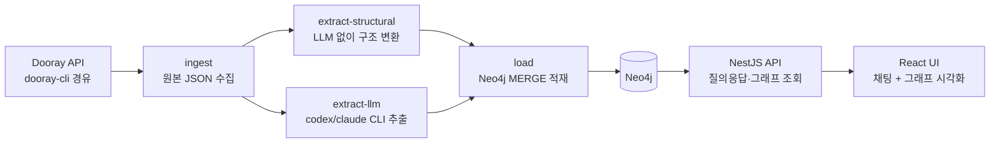

# 구현 계획 — Dooray 지식그래프 AI Agents MVP

- 스펙: `docs/SPEC.md` (요구사항·인수 기준), 평가 질문 gold: `eval/questions-{human,ai}-<project>.json` (단일 소스)
- 실행 모델: **Phase 0 순차 1워커 → Phase 1 병렬 codex subagent 4워커 → Phase 2 파일럿 품질 점검 → Phase 3 순차 통합**
- 품질 기준: `docs/EVAL-RUBRIC.md` (stage commit 마다 평가 스킬 실행, 통과까지 개선 루프)
- 상태: pending approval (사용자 승인 후 실행)

## 아키텍처 개요



핵심 설계: 추출을 **구조적 추출**(LLM 불필요 — 담당자·태그·댓글·업무 간 링크는 API 데이터에 이미 있음)과
**LLM 추출**(개념 언급·결정·업무↔위키 연결)로 분리한다.
LLM 호출량이 문서당 1회 수준으로 줄고, 구조 관계는 100% 정확해진다.

## RALPLAN-DR 요약

### Principles

1. 계약 우선 — 병렬 워커가 충돌하지 않도록 스키마·API·타입을 Phase 0 에서 고정한다.
2. LLM 최소화 — 구조로 얻을 수 있는 관계에 LLM 을 쓰지 않는다.
3. 재실행 가능 — 모든 단계는 멱등(MERGE)이고 문서 단위 캐시로 중단·재개된다.
4. 검증 주도 — 각 작업 패키지는 fixture 기반 완료 판정 명령을 가진다.

### Decision Drivers

1. 병렬 codex subagent 실행 — 의존성 최소 분해가 최우선.
2. 구독 CLI rate limit — LLM 호출량과 재시도 설계가 처리 시간을 결정.
3. 학습 가치 — GraphRAG·온톨로지 개념이 코드에 드러나야 한다.

### Options

- **모노레포 (pnpm workspaces) — 채택**
  - 장점: 공유 타입 패키지 하나로 계약 강제, 병렬 워커가 각자 workspace 만 수정
  - 단점: 초기 설정 소폭 증가
- 단일 NestJS 앱 + public 폴더 프론트 — 기각
  - 장점: 가장 단순
  - 단점: 프론트 워커와 백엔드 워커가 같은 패키지를 만져 병렬 충돌
- 백엔드/프론트 별도 저장소 — 기각: 계약 동기화 비용, MVP 에 과함

- **질의 방식: LLM Cypher 생성 + 근거 서브그래프 반환 — 채택**
  - 장점: 관계형 질문에 정확, 근거 노드가 자연히 나옴, 학습 가치 큼
  - 단점: Cypher 오류 대비 재시도 필요 (스키마를 프롬프트에 고정해 완화)
- LangChain GraphCypherQAChain 그대로 사용 — 보류: CLI 어댑터와 궁합 확인 후 결정 (직접 구현이 기본)

## 공유 계약 (Phase 0 에서 고정 — 이후 변경 금지)

### 디렉터리 구조

```
devloop-v2/
├── docker-compose.yml          # neo4j:5-community
├── package.json                # pnpm workspaces
├── packages/shared/            # 공유 타입·온톨로지 (WP 공통 의존)
│   └── src/ontology.ts, api.ts, raw.ts
├── apps/pipeline/              # WP1+WP2: 수집·추출·적재 CLI (NestJS standalone)
│   ├── src/ingest/  src/extract/  src/load/
│   └── data/raw/  data/graph/  data/cache/   # gitignore
├── apps/api/                   # WP3: 질의응답 API (NestJS)
└── apps/web/                   # WP4: React + Vite UI
```

### 온톨로지 (Neo4j 스키마 — packages/shared/src/ontology.ts 와 1:1)

노드 (라벨 · 키 property):

| Label    | key              | 주요 properties                            | 생성 주체              |
| -------- | ---------------- | ------------------------------------------ | ---------------------- |
| Project  | code             | name                                       | 구조                   |
| Task     | number           | subject, workflowClass, createdAt, url     | 구조                   |
| Wiki     | pageId           | subject, parentId                          | 구조                   |
| Person   | memberId         | name                                       | 구조                   |
| Comment  | commentId        | createdAt, excerpt(200자)                  | 구조                   |
| Concept  | name             | kind: product·component·type·tech·code-ref | 구조(태그) + LLM(본문) |
| Decision | id(task번호-seq) | summary, decidedAt                         | LLM                    |

관계:

| 관계                                | 방향                                                             | 생성 주체 |
| ----------------------------------- | ---------------------------------------------------------------- | --------- |
| CONTAINS                            | Project→Task, Project→Wiki                                       | 구조      |
| ASSIGNED_TO                         | Task→Person (to), CC                                             | 구조      |
| AUTHORED / COMMENTED                | Person→Task·Comment                                              | 구조      |
| HAS_COMMENT                         | Task→Comment                                                     | 구조      |
| TAGGED                              | Task→Concept (태그 3차원, dimension property)                    | 구조      |
| REFERENCES                          | Task→Task (본문·댓글의 `tc-ocr/NNN` 패턴)                        | 구조      |
| CHILD_OF                            | Task→Task (parent)                                               | 구조      |
| MENTIONS                            | Task·Wiki→Concept                                                | LLM       |
| DOCUMENTS                           | Wiki→Concept                                                     | LLM       |
| DEPENDS_ON                          | Concept→Concept (시스템·컴포넌트 의존, 위키 아키텍처 문서 위주)  | LLM       |
| DECIDED_IN / EVIDENCED_BY / AFFECTS | Decision→Task·Comment·Concept                                    | LLM       |
| RELATES_TO                          | Task→Task (선후·인과, kind property: precedes·causes·follows-up) | LLM       |

제약: 각 라벨 key 에 UNIQUE constraint.
`Task.subject`, `Wiki.subject`, `Concept.name` 에 fulltext index — 한국어 토큰화를 위해 analyzer 는 `cjk` 로 지정한다.

### Concept 표준 사전 (packages/shared/src/concepts.ts)

Concept 이름 파편화(같은 대상이 "General OCR 모델"/"모델 서버"/"General 모델"로 갈라지는 문제)가
관계형 질문의 연결을 끊는 1번 위험이므로, 이름 정규화를 계약으로 강제한다.

- 형태: `{ canonical: string, kind, aliases: string[] }` 배열. 공통 코어(도메인 무관 기술 용어)는 shared 에 두고, 프로젝트별 사전은 자동 생성한다.
- 프로젝트별 자동 시드: `pnpm --filter pipeline concepts:seed --project <code>` 가 태그명·위키 제목 핵심 명사·업무 제목 prefix 에서 `data/concepts/<project>.json` 을 생성하고, 사람이 별칭을 보강할 수 있다.
  - tc-ocr 실측 기준 약 100개: 태그 3차원 21종, 제목 prefix 15종(`[OCR.Console]` 등), 도메인 용어 위키("OCR 도메인 용어 정리") 등.
  - 자동 생성으로 만들어야 tc-ocr 이후 다른 프로젝트에도 같은 품질 루프를 돌릴 수 있다.
- 사용처 2곳:
  - WP2 추출 프롬프트에 허용 Concept 목록으로 제공 — LLM 은 목록 밖 개체를 만들 때만 신규 이름 허용.
  - WP3 적재 시 alias→canonical 정규화 후 MERGE — 사전 밖 신규 이름은 소문자·공백 정규화만 적용하고 리포트에 집계.

### REST API 계약 (apps/api — packages/shared/src/api.ts 와 1:1)

| Endpoint                           | 요청                 | 응답                                                                                            |
| ---------------------------------- | -------------------- | ----------------------------------------------------------------------------------------------- |
| POST /api/query                    | { question: string } | { answer: string, evidence: { nodes: GraphNode[], relationships: GraphRel[] }, cypher: string } |
| GET /api/graph/stats               | —                    | { nodes: Record<label, count>, relationships: Record<type, count> }                             |
| GET /api/graph/nodes/:id/neighbors | ?depth=1             | { nodes, relationships }                                                                        |
| GET /api/graph/search?q=           | —                    | GraphNode[] (fulltext)                                                                          |
| GET /api/ontology                  | —                    | { nodes: OntologyNode[], relationships: OntologyRelationship[] }                                |
| GET /api/graph/samples             | ?label= 또는 ?type=  | { nodes, relationships } (라벨·관계 유형별 실제 인스턴스 최대 5개)                              |

GraphNode = { id, label, key, display, properties }. GraphRel = { id, type, startId, endId, properties }.

`/api/graph/samples` 는 라벨·관계명을 Cypher 에 보간하므로 온톨로지 화이트리스트로 검증한다.
계약에 없는 값이 오면 Neo4j 로 쿼리를 보내지 않고 거절한다.

### LLM CLI 어댑터 계약

```typescript
interface LlmCli {
  complete(
    prompt: string,
    opts?: { timeoutMs?: number; model?: string },
  ): Promise<LlmResult>;
}
// LlmResult = { text: string, elapsedMs: number, tokens?: { in: number; out: number } }
// 구현: CodexCliAdapter (codex exec -m <model>), ClaudeCliAdapter (claude -p --model <model>)
// 선택: env LLM_PROVIDER=codex|claude + LLM_MODEL — kg-model-bench 벤치마크가 모델을 바꿔가며 호출한다
// 응답은 JSON 강제 + zod 파싱 + 1회 재시도. elapsedMs·tokens 는 비용 벤치마크의 측정 원천
```

추출 캐시 키는 `docId + model + promptVersion` 이다 — 모델·프롬프트를 바꾼 벤치마크·재실행에서 캐시가 오염되지 않게 한다 (`data/cache/<model>/<docId>.json`).

### 수집 원본 계약 (data/raw/<project>/ — packages/shared/src/raw.ts)

파이프라인 전 단계는 `--project <code>` 파라미터를 받는다 (기본값 tc-ocr).
tc-ocr 전용 하드코딩을 금지해, 이후 다른 프로젝트로 색인→검색→품질 확인 루프를 반복할 수 있게 한다.

- `posts.json` — dooray post list --all 결과 배열
- `posts/<number>.json` — { post: post get 결과, comments: comment list 결과 }
- `wiki/<pageId>.json` — wiki page get 결과 (트리 BFS 로 발견)
- `tags.json`, `members.json` — 태그 ID→이름, 멤버 ID→이름 매핑

## Phase 0 — 스캐폴드·계약 고정 (순차, codex 워커 1)

**WP0**: 위 공유 계약을 코드로 만든다.

- 산출물: 모노레포 스캐폴드 전체, `packages/shared` 타입 완성, docker-compose.yml, `.env.example`, 루트 README(실행 방법), Neo4j constraint 생성 스크립트(`apps/pipeline/src/load/schema.cy`), 각 앱 빌드 통과하는 빈 껍데기.
- 완료 판정: `pnpm install && pnpm -r build` 성공, `docker compose up -d` 후 Neo4j 접속, `pnpm --filter pipeline apply-schema` 로 constraint 생성 확인.

## Phase 1 — 병렬 구현 (codex 워커 4, 상호 의존 없음)

모든 워커는 `packages/shared` 를 읽기 전용으로 의존한다. 계약 변경이 필요하면 중단하고 보고한다.

**WP1 수집기** (`apps/pipeline/src/ingest`)

- dooray CLI 를 child_process 로 호출해 원본 계약대로 data/raw/ 를 채운다.
  - 업무: `post list --all` → 건별 `post get` + `comment list`
  - 위키: root 부터 `--parent` BFS (47건)
  - 매핑: `project tags`, `member list` (+ 미해석 memberId 는 `member get`)
- 파일 존재 시 건너뛰는 재개(resume) 지원.
- 완료 판정: 실데이터 실행으로 posts 490±5, wiki 47 파일 생성 + 통계 출력. mock fixture 단위 테스트 통과.

**WP2 추출기** (`apps/pipeline/src/extract`)

- 구조적 추출: data/raw/ → data/graph/structural.jsonl (노드·관계, 온톨로지 계약 준수). LLM 불사용. `tc-ocr/NNN`·`\w+(Service|Controller|Interceptor):\d+` 패턴 포함.
- LLM 추출: 문서(업무 본문+댓글 병합, 위키 본문) 1건당 CLI 1회 호출 → MENTIONS·DOCUMENTS·DEPENDS_ON·Decision·RELATES_TO 를 JSON 으로 받아 data/graph/llm.jsonl 에 기록.
  - 프롬프트에 고정 온톨로지·허용 관계·JSON 스키마 명시, few-shot 1개 포함.
  - 프롬프트에 Concept 표준 사전(허용 목록·별칭)을 포함해 이름 파편화를 원천 차단.
  - 문서 단위 캐시(data/cache/<docId>.json) — 재실행 시 캐시 히트는 호출 생략.
  - 실패·rate limit 은 지수 백오프 후 다음 문서로 (실패 목록 리포트).
- 완료 판정: fixture 문서 5건 추출 결과가 zod 스키마 통과 + 실데이터 10건 샘플 실행 리포트.

**WP3 백엔드 API** (`apps/api` + `apps/pipeline/src/load`)

- load: jsonl → Concept 별칭 정규화(표준 사전 기반) → Neo4j MERGE 적재 (멱등), 적재 후 라벨·관계 통계 출력.
- API: 계약 4개 엔드포인트 구현.
  - /api/query 는 **2단계 질의**로 구현한다 — 한국어 질문이 노드 이름과 exact match 되지 않는 문제를 막기 위해서다.
    - 1단계 anchor: LLM 이 질문에서 핵심 용어를 뽑고, fulltext(cjk) 검색으로 anchor 노드 후보를 확보.
    - 2단계 탐색: anchor 노드 + 온톨로지 스키마를 프롬프트에 넣어 Cypher 생성 → 실행(읽기 전용 세션) → 결과로 LLM 이 답변 합성. Cypher 오류 시 오류 메시지 포함 1회 재생성.
- 완료 판정: fixture 그래프 시드 후 e2e — stats·search·neighbors 응답 계약 일치, query 는 mock LLM 로 파이프 검증.

**WP4 프론트엔드** (`apps/web`)

- React + Vite. 좌측 채팅 패널(질문·답변·근거 인용 목록), 우측 그래프 캔버스(react-force-graph 또는 cytoscape.js).
- 답변 도착 시 evidence 서브그래프 렌더 + 하이라이트, 노드 클릭 → neighbors 호출로 확장, 라벨별 색상·범례.
- API 는 계약 기반 mock(MSW 또는 fixture 서버)으로 개발 — 통합은 Phase 3.
- 완료 판정: mock 데이터로 질문→답변→서브그래프 하이라이트→클릭 확장 동작, `pnpm --filter web build` 통과.

## Phase 2 — 파일럿 추출·품질 점검 (순차, 통과 조건)

전량 추출(537건) 전에 추출 품질을 검증한다.
실측에서 업무 483 본문에 `tc-ocr/NNN` 명시 참조가 0건이었듯,
업무 간 연결이 LLM 추출 품질에 크게 의존하므로 전량 실행 전 확인이 필수다.

1. `eval/questions-{human,ai}-tc-ocr.json` 의 gold 근거 업무를 포함한 30건 파일럿 색인 (ingest→extract→load).
2. Concept 파편화 측정 — 같은 대상이 다른 이름으로 중복 생성됐는지 확인, 사전·별칭 보완.
3. 평가 스킬 2종(`kg-eval-human`, `kg-eval-ai`) 첫 실행 — 파일럿 통과 기준은 `docs/EVAL-RUBRIC.md`.
4. 통과 조건 미달 시 프롬프트·사전·질의 엔진을 보완하고 재실행 — 통과 전 전량 추출 진행 금지.

## Phase 3 — 통합·실데이터 검증 (순차, codex 워커 1 + 사용자 확인)

1. 전체 파이프라인 1회 실행: `pnpm pipeline --project tc-ocr` (단일 진입 — 인수 기준 4).
2. 적재 통계 리포트 (인수 기준 1).
3. 평가 스킬 2종 실행 — `docs/EVAL-RUBRIC.md` 의 인수 기준선 통과 (인수 기준 2).
4. web ↔ api 실통합, 확정 질문 UI 시연 (인수 기준 3).
5. README 에 결과·스크린샷·평가 리포트 정리.

## 품질 게이트 — stage commit 평가와 개선 루프

- 평가 스킬 3종을 리포지토리에 둔다 (`.claude/skills/`).
  - `kg-eval-human`: 사람의 실제 질문 방식(모호한 지칭·별칭·상대 시간)을 역설계한 질문 은행으로 검색 품질을 채점.
  - `kg-eval-ai`: AI 에이전트의 질문 방식(명시적 개체·multi-hop·집계·경로)을 역설계한 질문 은행으로 채점.
  - `kg-model-bench`: 추출·질의 LLM 모델 조합별 품질·비용(시간·호출·환산가)을 비교해 최적 모델을 판정. Phase 2 파일럿 직후 1회 실행해 기본 모델을 정하고, 이후 모델 변경 전마다 재실행.
  - 질문 은행은 난이도 L1(단순 조회)~L5(종합·비교) 사다리로 구성한다 — 규칙은 EVAL-RUBRIC 섹션 2.
- 실행 시점: **stage commit 마다** — 각 phase 병합 커밋, 그리고 추출·질의 로직을 바꾼 커밋 직후 메인 세션이 스킬을 실행해 점수를 기록한다.
- 기준·채점표·통과선은 `docs/EVAL-RUBRIC.md` 가 단일 소스다. 리포트는 `eval/reports/` 에 누적한다.
- 점수 미달 시 개선 루프: 실패 원인을 사전(정규화)/추출 프롬프트/스키마/질의 엔진 중 하나로 분류 → 수정 → 재평가. 통과할 때까지 반복한다.
- **일반화 루프 (tc-ocr 이후)**: 품질을 계속 올리는 방법은 사용자가 접근 가능한 다른 Dooray 프로젝트로
  색인 → 검색 → 품질 확인을 반복하는 것이다.
  - `pnpm pipeline --project <code>` + `concepts:seed` 로 새 프로젝트를 색인하고,
    평가 스킬의 gold set 부트스트랩 절차로 그 프로젝트의 질문 은행을 만들어 같은 rubric 으로 채점한다.
  - tc-ocr 에 과적합된 규칙(사전·프롬프트)이 드러나면 공통 코어로 일반화한다.

## 처리 시간 추정 (비용 대신 시간이 관리 대상)

- LLM 추출 대상: 업무 490 + 위키 47 = **537 문서** (댓글은 업무 문서에 병합).
- 문서당 CLI 1회 호출, 호출당 20~40초 가정 → 순차 3~6시간.
- 파이프라인 내 동시 실행 4로 나누면 **약 1~1.5시간** — rate limit 도달 시 백오프로 자동 감속.
- 캐시 덕에 중단 후 재실행은 남은 문서만 처리.

## Risks and Mitigations

| 위험                                 | 완화                                                                                                         |
| ------------------------------------ | ------------------------------------------------------------------------------------------------------------ |
| 구독 CLI rate limit 로 추출 중단     | 문서 단위 캐시 + 지수 백오프 + 재개 지원, 실패 목록 리포트                                                   |
| LLM 추출 품질 낮음 (관계 누락·환각)  | 구조적 추출 분리로 LLM 의존 최소화, 질문 은행(eval/)과 rubric 채점으로 측정, 프롬프트에 스키마·few-shot 고정 |
| LLM 이 낸 Cypher 오류·위험 쿼리      | 읽기 전용 세션 + 오류 피드백 재생성 1회 + cypher 응답 노출로 디버깅                                          |
| Dooray API 부하·차단                 | dooray CLI 순차 호출 + 원본 캐시 (수집은 1회성)                                                              |
| 병렬 워커 간 계약 위반               | Phase 0 계약 고정, shared 변경 금지 규칙, Phase 3 통합에서 계약 검증                                         |
| codex 워커 환경 차이 (인증·경로)     | 각 WP 완료 판정을 fixture 기반으로 설계 — 실데이터 필요 단계는 WP1·Phase 2·3 에 국한                         |
| Concept 이름 파편화로 그래프 단절    | 표준 사전 시드 + 프롬프트 허용 목록 + 적재 정규화, 파편화 지표를 rubric 정적 기준으로 게이트                 |
| tc-ocr 과적합 (다른 프로젝트서 붕괴) | 전 단계 `--project` 파라미터화 + 사전 자동 시드, 타 프로젝트 반복 색인·평가 루프로 일반화                    |

## Verification Steps (인수 기준 대응)

1. `pnpm pipeline --project tc-ocr` 1회 실행 → 통계에서 Task=490±5, Wiki=47 확인.
2. 평가 스킬 2종 실행 → `docs/EVAL-RUBRIC.md` 인수 기준선(human/ai 점수·환각 0) 통과.
3. 브라우저에서 질문 → 서브그래프 하이라이트 → 노드 클릭 확장 확인.
4. data/ 삭제 후 재실행으로 동일 통계 재현.

## codex subagent 실행 지침 (승인 후)

- 워커 프롬프트 = 본 문서의 해당 WP 절 + `docs/SPEC.md` + 공유 계약 절. 계약 밖 변경 금지를 명시한다.
- Phase 0 완료 → WP1~WP4 를 4개 codex 워커로 동시 기동 (OMC `omc-teams` codex 워커 또는 `omc team N:codex`).
- 각 WP 는 별 브랜치에서 작업 후 완료 판정 명령 출력과 함께 보고, 메인 세션이 검토·병합한다.
- 각 phase 병합 커밋마다 메인 세션이 평가 스킬(가능한 축)을 실행해 점수를 `eval/reports/` 에 기록한다.
- Phase 2(파일럿)·Phase 3(통합)은 병합 후 단일 워커로 진행하고, 평가 결과를 사용자에게 보고한다.
