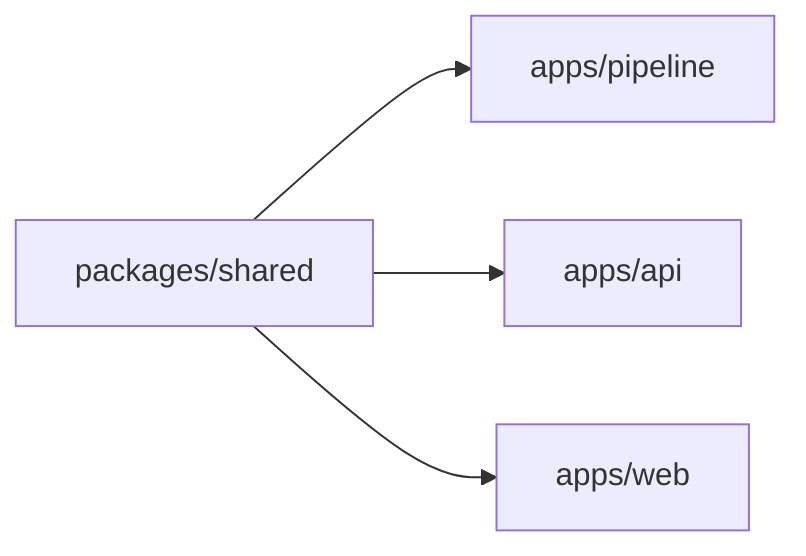

# 코드 아키텍처

- 상태: 기준선 (2026-07-29 작성)

이 문서는 **모듈 책임과 의존 방향**을 소유한다.
단계 흐름은 `docs/flow.md`, 데이터 계약은 `docs/data-schema.md` 가 소유한다.

## 분할 기준

두 기준을 **직교하게** 쓴다.

- **패키지·단계 경계는 기능·역할 도메인으로 가른다** (지식 노드 종류별이 아니다)
- **한 단계 안의 구조는 하는 일로 가른다** — 필요한 단계에만 적용한다

zod 스키마는 `*.schema.ts`, 상수는 `*.const.ts` 로 분리한다.

### 노드 종류별로 나누지 않은 이유

`Task/Wiki/Concept` 별로 모듈을 나누지 않았다.
구조 추출기가 모든 노드를 한 번에 순회하고 적재기도 전 노드를 한 트랜잭션에 MERGE 하기 때문이다.
쪼개면 응집이 깨지고 호출이 얽힌다.

정규화도 같은 성질이다 — 어떤 Concept 을 어느 대표로 합칠지는 **다른 문서들이 그 이름을
몇 번 참조했는지**에 달려 있다. 항목 하나만 보고는 결정할 수 없다.

## 패키지 구성

pnpm workspaces monorepo 다.

```
packages/shared/     온톨로지 계약 · API 타입 · Concept 표준 사전 코어
apps/pipeline/       수집 → 추출 → 적재 CLI
apps/api/            질의응답 REST (NestJS)
apps/web/            React 와 Vite UI
```

의존 방향은 한쪽이다.



`apps/*` 끼리는 서로 의존하지 않는다. 공유가 필요하면 `packages/shared` 로 올린다.

**`packages/shared` 를 고치면 의존 앱을 다시 빌드해야 한다.**
`pnpm --filter api test:unit` 은 shared 를 재빌드하지 않는다.
계약을 바꾸고 테스트하려면 `pnpm --filter @devloop/shared build` 를 먼저 돌린다.

## packages/shared

| 디렉터리 | 소유 |
| --- | --- |
| `ontology/` | 노드 라벨·관계 유형 정의와 방향. 그래프 계약의 단일 소스 |
| `graph/` | 그래프 노드·관계 런타임 타입, 산출물 파일명 상수 |
| `api/` | REST 요청·응답 스키마 |
| `concept/` | Concept 표준 사전 코어 (도메인 무관 기술 용어) |
| `raw/` | 원본 문서 스키마 |

## apps/pipeline

단계별 디렉터리다. 디렉터리 이름이 CLI 단계 이름과 대응한다.

| 디렉터리 | 단계 | 책임 |
| --- | --- | --- |
| `fetch/` | `fetch-dooray` | 외부 API 호출과 원본 저장. 가공하지 않는다 |
| `concepts/` | `seed-concepts`·`audit-concepts` | Concept 사전 시드 생성과 정규화 감사 |
| `parse/` | `parse-structure` | 규칙 파싱. 정규식·필드 매핑만 쓴다 |
| `infer/` | `infer-knowledge` | LLM 추출. 캐시·재시도·동시성·관계 검증 |
| `neo4j/` | `sync-neo4j`·`apply-schema` | DB 를 건드리는 것만 모은다 |
| `llm/` | — | LLM CLI 어댑터 (codex·claude) |
| `raw-reader.ts` | — | 원본 읽기. `parse` 와 `infer` 가 함께 쓴다 |

`raw-reader.ts` 가 루트에 있는 이유 — 두 단계가 공용으로 쓰므로 한쪽에 넣으면 의존이 역류한다.

### 현재 남은 문제 — `neo4j/sync.ts` 가 875줄이다

적재 단계 안에 성격이 다른 관심사가 섞여 있다.

| 관심사 | 규모 | 문제 |
| --- | --- | --- |
| 입력 읽기 (`jsonl`·사전) | 약 60줄 | — |
| **정규화** (별칭 치환·엔드포인트 해석·노드 병합) | **약 340줄** | Neo4j 의존이 0인데 적재 파일에 있다 |
| Neo4j 쓰기 (MERGE) | 약 160줄 | — |
| 일회성 마이그레이션 | 약 20줄 | **매 적재마다 조건 없이 실행된다** |
| 통계 수집·오케스트레이션 | 약 100줄 | — |

여기에 경계를 흐리는 것이 둘 더 있다.

- **적재가 추출 산출물을 덮어쓴다** — 적재 중 관계 정리기가 `inferred.jsonl` 을 `writeFile` 한다.
  "읽기만 할 입력" 이 적재 과정에서 바뀐다
- **사전 로딩이 두 곳에 각자 구현돼 있다** — `infer` 는 LLM 프롬프트 힌트로 읽고,
  `sync` 는 별칭 치환에 읽는다. 한쪽만 고치면 조용히 어긋난다

정규화가 적재에 묶여 있어 **별칭을 바꿨을 때 효과를 적재 없이 볼 수 없다.**
적재기가 MERGE 전용이라 틀리면 그래프를 초기화해야 한다.

분해 방향은 `docs/adr/0002-resolve-graph-as-pure-stage.md` 에 있다.

## apps/api

NestJS 다. 도메인별 디렉터리로 나뉜다.

| 디렉터리 | 책임 |
| --- | --- |
| `config/` | 환경설정 zod 검증. **필수 값이 없으면 기동을 실패시킨다** |
| `query/` | 질의응답 — 앵커 검색, Cypher 생성, 근거 정제, 답변 합성 |
| `graph/` | 그래프 조회 엔드포인트 (통계·검색·표본·이웃) |
| `ontology/` | 온톨로지 계약 노출 |
| `neo4j/` | 드라이버·세션 관리 |
| `llm/` | LLM CLI 어댑터 |

루트에 1줄 재export 파일이 몇 개 있다 (`llm-cli.ts`·`neo4j.service.ts`·`ontology.controller.ts`).
도메인 이동 과정의 호환 계층이다.

`graph-query.service.ts` 는 조회 4종만 담고, 전문 검색은 `query` 도메인에 위임한다 —
질의응답 앵커 검색과 같은 의미를 써야 하므로 구현을 복제하지 않았다.

### 설정이 기동을 실패시키는 이유

값이 없을 때 조용히 기본값으로 도는 구조에서 사고가 났다.
`.env` 에 질의 모델이 지정돼 있었지만 API 가 그 파일을 읽지 않아, CLI 기본 모델로 질의가 돌았다.
문서에 확정됐다고 적힌 모델이 아니었다.

- 필수 값이 없으면 `exit 1` 로 죽는다. 부재를 즉시 드러나는 실패로 바꿨다
- 다른 값들은 코드 기본값이 `.env` 와 우연히 같아 드러나지 않았다. **우연한 일치가 가장 위험하다**

자세한 결정은 `docs/adr/0003-fail-fast-config.md` 에 있다.

## apps/web

React 와 Vite 다. 화면 4종이다.

| 화면 | 역할 |
| --- | --- |
| 질의응답 | 질문 입력, 답변, 근거 서브그래프 하이라이트 |
| 온톨로지 정의 | 노드 라벨·관계 유형 계약 조망 |
| 스키마 맵 | 라벨·관계별 표본 탐색 (페이징) |
| 인스턴스 탐색 | 노드 검색과 이웃 확장 |

**Vite 는 워크스페이스 의존성 변경으로 사전 번들 캐시를 무효화하지 않는다.**
`packages/shared` 를 다시 빌드하면 웹이 옛 캐시를 물어 named export 가 사라진다.
`dev` 스크립트에 `--force` 를 붙여 막았다.

## 테스트 배치와 함정

| 위치 | 대상 |
| --- | --- |
| `apps/pipeline/src/**/*.test.ts` | 단위 (빌드 산출물로 실행) |
| `apps/pipeline/test/*.test.cjs` | 통합 (fixture 기반) |
| `apps/api/test/*.test.js` | 단위·계약 |
| `apps/api/test/api.e2e.test.js` | e2e (별도 Neo4j 인스턴스) |

세 가지가 조용히 무력화될 수 있다.

- `pnpm --filter api test` 는 `test` 스크립트가 없으면 **exit 0 으로 통과**한다. `test:unit` 을 쓴다
- `apps/pipeline` 의 test glob 이 경로를 열거하는 방식이라 새 디렉터리는 자동으로 잡히지 않는다
- e2e 는 **컨테이너 기동 실패와 테스트 실패가 구분되지 않아** 결함이 오래 숨을 수 있다.
  fixture 소스 파일명이 적재기 기대와 어긋나 예외로 죽고 있었는데, 기동 단계에서 먼저 막혀
  예외까지 도달조차 못 했다

통과 표시가 아니라 **테스트 개수**를 확인한다.
