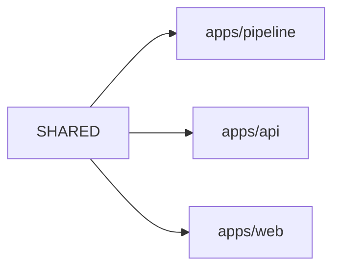

# 코드 아키텍처

- 상태: 기준선 (2026-07-29 작성)

이 문서는 **모듈 책임과 의존 방향**을 소유한다.
단계 흐름은 `docs/flow.md`, 데이터 계약은 `docs/data-schema.md` 가 소유한다.

## 스택 제약

| 항목 | 제약 |
| --- | --- |
| 언어 | TypeScript 단일. 파이프라인·API 는 NestJS, 프론트는 React 와 Vite |
| 지식그래프 | Neo4j (docker-compose) |
| 판단 저장소 | Postgres. `packages/registry`가 스키마·repository·service를 소유한다 ([ADR 0005](adr/0005-curation-in-relational-store.md)) |
| LLM | 구독 계정 CLI 만 쓴다. 종량제 API 는 금지다 ([ADR 0002](adr/0002-llm-via-subscription-cli.md)) |
| 원천 접근 | 기존 `dooray-cli` 를 자식 프로세스로 호출해 재사용한다. 인증을 다시 구현하지 않는다 |
| 실행 환경 | 로컬 개발 기계 |

## 분할 기준

두 기준을 **직교하게** 쓴다.

- **패키지·단계 경계는 기능·역할 도메인으로 가른다** (지식 노드 종류별이 아니다)
- **한 단계 안의 구조는 하는 일로 가른다** — 필요한 단계에만 적용한다

zod 스키마는 `*.schema.ts`, 상수는 `*.const.ts` 로 분리한다.

### 노드 종류별로 나누지 않은 이유

`Task/Wiki/Concept` 별로 모듈을 나누지 않았다.
구조 추출기가 모든 노드를 한 번에 순회하고 적재기도 전 노드를 한 트랜잭션에 MERGE 하기 때문이다.
쪼개면 응집이 깨지고 호출이 얽힌다.

정규화도 같은 성질이다 — 어떤 Concept 을 어느 대표로 합칠지는 **다른 문서들이 그 이름을
몇 번 참조했는지**에 달려 있다. 항목 하나만 보고는 결정할 수 없다.

## 패키지 구성

pnpm workspaces monorepo 다.

```
packages/shared/     온톨로지 계약 · API 타입 · Concept 표준 사전 코어
apps/pipeline/       수집 → 추출 → 적재 CLI
apps/api/            질의응답 REST (NestJS)
apps/web/            React 와 Vite UI
.claude/skills/      저장소 전용 개발·평가 절차와 번들 스크립트
eval/                질문 은행·대표 흐름 평가 세트·평가 리포트
```

의존 방향은 한쪽이다.



`apps/*` 끼리는 서로 의존하지 않는다. 공유가 필요하면 `packages/shared` 로 올린다.

평가 실행기는 별도 `apps/*` 패키지로 만들지 않는다.
제품 런타임이 아니라 개발 품질 점검이고, 현재 API 계약만으로 실행할 수 있기 때문이다.
반복 실행에 필요한 결정적 동작은 `kg-eval` 스킬의 `scripts/`에 두고,
평가 방법과 의미 판정 절차는 스킬 본문과 `docs/EVAL-RUBRIC.md`가 소유한다.

ADR 0005가 채택한 판단 저장소는 `packages/registry`가 소유한다.
스키마·repository·service는 이 패키지에 두고, 파이프라인의
`register-project`·`import-curation`·`export-curation` 명령이 진입점을 제공한다.
웹이 import하는 `packages/shared`에는 Node 전용 저장소 클라이언트를 넣지 않는다.

**`packages/shared` 를 고치면 의존 앱을 다시 빌드해야 한다.**
`pnpm --filter api test:unit` 은 shared 를 재빌드하지 않는다.
계약을 바꾸고 테스트하려면 `pnpm --filter @devloop/shared build` 를 먼저 돌린다.

## packages/shared

| 디렉터리 | 소유 |
| --- | --- |
| `ontology/` | 노드 라벨·관계 유형 정의와 방향. 그래프 계약의 단일 소스 |
| `graph/` | 그래프 노드·관계 런타임 타입, 산출물 파일명 상수 |
| `api/` | REST 요청·응답 스키마 |
| `concept/` | Concept 표준 사전 코어 (도메인 무관 기술 용어) |
| `raw/` | 원본 문서 스키마 |

## packages/registry

Postgres 판단 저장소의 스키마와 읽기·쓰기 계층을 소유한다.
파이프라인은 이 패키지의 공개 함수만 사용하며 SQL과 Drizzle 구현을 직접 알지 않는다.

### repository 는 트랜잭션을 열지 않는다

repository는 행 단위 조회·삽입·삭제만 수행하고, 전달받은 `RegistryExecutor`를 그대로 사용한다.
여러 쓰기를 원자적으로 묶는 경계는 service가 소유한다.
따라서 `curation.service.ts`와 `project.service.ts`만 트랜잭션을 열며 `*.repo.ts`는 열지 않는다.

## apps/pipeline

단계별 디렉터리다. 디렉터리 이름이 CLI 단계 이름과 대응한다.

| 디렉터리 | 단계 | 책임 |
| --- | --- | --- |
| `fetch/` | `fetch-dooray` | 외부 API 호출과 원본 저장. 가공하지 않는다 |
| `concepts/` | `seed-concepts`·`audit-concepts` | Concept 사전 시드 생성과 정규화 감사 |
| `parse/` | `parse-structure` | 규칙 파싱. 정규식·필드 매핑만 쓴다. 저장 텍스트 상한은 `parse.const.ts`, 훅 댓글 판정과 머리말 제거는 `github-hook-comment.ts` 가 소유한다 |
| `infer/` | `infer-knowledge` | LLM 추출. 캐시·재시도·동시성·관계 검증 |
| `neo4j/` | `sync-neo4j`·`apply-schema` | DB 를 건드리는 것만 모은다 |
| `config/` | — | 환경변수 검증과 주입 |
| `llm/` | — | LLM CLI 어댑터 (codex·claude) |
| `raw-reader.ts` | — | 원본 읽기. `parse` 와 `infer` 가 함께 쓴다 |

`raw-reader.ts` 가 루트에 있는 이유 — 두 단계가 공용으로 쓰므로 한쪽에 넣으면 의존이 역류한다.

**원천 형식에 종속된 판정 규칙은 전용 모듈로 뺀다.** GitHub 훅 댓글 판정과 머리말 제거가 그 예다.
`structural-extractor.ts` 안에 정규식으로 섞어 두면 세 가지가 나빠진다.

- 규칙이 좁은지 넓은지 눈으로 확인하기 어렵다. 넓게 잡아 사람 댓글 317건을 깎을 뻔했다
- 훅 종류가 늘거나 다른 서비스가 붙을 때 손댈 자리가 흩어진다
- 규칙 단위 테스트를 붙일 대상이 없어, 오탐이 생겨도 어디를 고칠지 드러나지 않는다

### 설정은 단계 함수에 인자로 내려간다

파이프라인도 API 와 같이 검증된 설정 객체를 쓴다 ([ADR 0003](adr/0003-fail-fast-config.md)).
`main.ts` 가 이미 Nest 애플리케이션 컨텍스트를 띄우므로 새 장치가 아니다.

단계 명령들은 DI 밖 평범한 함수이므로 **설정을 인자로 받는다.**
전역 접근을 남기면 어느 값이 어디서 쓰이는지 다시 흩어져 이관의 의미가 없다.

### `neo4j/sync.ts` 를 875줄에서 303줄로 줄였다

적재 단계 안에 성격이 다른 관심사가 섞여 있었다.

| 관심사 | 규모 | 처리 |
| --- | --- | --- |
| 입력 읽기 (`jsonl`·사전) | 약 60줄 | `resolve/io.ts` 로 옮겼다 |
| **정규화** (별칭 치환·엔드포인트 해석·노드 병합) | **약 340줄** | `resolve/` 로 옮겼다. Neo4j 의존이 0이었다 |
| Neo4j 쓰기 (MERGE) | 약 160줄 | 남았다 |
| 일회성 마이그레이션 | 약 20줄 | 삭제했다. 매 적재마다 조건 없이 실행되고 있었다 |
| 통계 수집·오케스트레이션 | 약 100줄 | 남았다 |

경계를 흐리던 것 둘도 함께 사라졌다.

- **적재가 추출 산출물을 덮어썼다** — 적재 중 관계 정리기가 `inferred.jsonl` 을 `writeFile` 했다.
  정리가 순수 함수로 메모리에서 돌게 되어 파일 출력은 `resolve-graph` 단독 실행 때만 일어난다
- **사전 로딩이 두 곳에 각자 있었다** — 생성 사전과 판단 합성을 `concepts/dictionary.ts`로 모았다.
  `infer`와 `resolve/io.ts`가 같은 로더를 사용한다

정규화가 적재에 묶여 있어 **별칭을 바꿨을 때 효과를 적재 없이 볼 수 없었다.**
적재기가 MERGE 전용이라 틀리면 그래프를 초기화해야 했다.

### `resolve/` 가 그 정규화를 갖는다

정규화는 순수 함수이고, 그 결과를 파일로 내놓는 `resolve-graph` 명령이 있다.
`sync-neo4j` 는 그 파일을 읽지 않고 같은 순수 함수를 직접 부른다. 결정과 근거는
`docs/adr/0004-resolve-as-inspection-stage.md` 에 있다.

```
apps/pipeline/src/
  resolve/                   Neo4j 를 모른다. 파일과 순수 함수만 다룬다
    resolve.ts               단계 진입점과 resolveGraph
    resolve.schema.ts        ResolveResult zod 계약
    concept-alias.ts         사전 → 별칭 맵
    endpoint.ts              엔드포인트 색인·해석
    node-merge.ts            노드 병합·미매칭 Concept 대표 선정
    io.ts                    입력 읽기·resolved.jsonl 쓰기
  neo4j/
    sync.ts                  Neo4j 쓰기만 (875 → 303줄)
    reset.ts                 그래프 초기화 (--force 필수, NEO4J_URI 필수, 운영 포트는 --allow-production 도 필수)
```

`resolve/` 를 `neo4j/` 밖에 두는 이유 — Neo4j 를 모르기 때문이다. 디렉터리 이름이 그 사실을 말해야 한다.

정규화를 4개 파일로 가른 기준은 **전역 시야가 필요한 단위**다.

| 파일 | 전역 시야 |
| --- | --- |
| `concept-alias.ts` | 사전 전체 |
| `endpoint.ts` | 전체 노드 — 색인을 만들어야 관계 양끝을 해석한다 |
| `node-merge.ts` | 전체 노드·관계 — 참조 수를 세어 대표를 고른다 |
| `resolve.ts` | 위 셋을 순서대로 흘린다 |

**더 쪼개지 않는다.** 정규화도 위의 "노드 종류별로 나누지 않은 이유" 와 같은 성질이다 —
어떤 Concept 을 어느 대표로 합칠지는 다른 문서들이 그 이름을 몇 번 참조했는지에 달려 있다.

함께 정리한 것이다.

- **사전 로딩 중복 제거** — 적재 쪽 구현을 `io.ts` 의 `readResolveInput` 한 곳으로 모았다
- **정리 함수 순수화** — 파일을 덮어쓰던 함수 아래에 순수 함수를 깔고 둘이 같은 로직을 쓰게 했다.
  `sync-neo4j` 는 순수 함수만 쓰므로 적재가 `inferred.jsonl` 을 덮어쓰지 않는다
- **죽은 마이그레이션 삭제** — 적재기가 만들지 않는 상태를 고치려던 코드였다 (실측 근거는 ADR 0004)
- **인자 파싱 공용화** — `readFlag` 와 `readDataDirFlag` 를 `cli-options.ts` 로 올렸다.
  `--data-dir` 우선순위를 한 곳에 두어 `resolve-graph` 와 `sync-neo4j` 가 같은 데이터를 본다

## apps/api

NestJS 다. 도메인별 디렉터리로 나뉜다.

| 디렉터리 | 책임 |
| --- | --- |
| `config/` | 환경설정 zod 검증. **필수 값이 없으면 기동을 실패시킨다** |
| `query/` | 질의응답 — 앵커 검색, Cypher 생성, 근거 정제, 답변 합성 |
| `graph/` | 그래프 조회 엔드포인트 (통계·검색·표본·이웃) |
| `ontology/` | 온톨로지 계약 노출 |
| `neo4j/` | 드라이버·세션 관리 |
| `llm/` | LLM CLI 어댑터 |

루트에 1줄 재export 파일이 몇 개 있다 (`llm-cli.ts`·`neo4j.service.ts`·`ontology.controller.ts`).
도메인 이동 과정의 호환 계층이다.

`graph-query.service.ts` 는 조회 4종만 담고, 전문 검색은 `query` 도메인에 위임한다 —
질의응답 앵커 검색과 같은 의미를 써야 하므로 구현을 복제하지 않았다.

그래서 검색 대상 인덱스를 늘리면 `/api/graph/search` 결과도 함께 바뀐다. 화면 검색에
`Comment` 노드가 섞여 나오므로, 목록에 쓰는 표시 문자열은 짧게 자른다. 저장한 본문은 길게
두되 사람이 훑는 목록에는 앞부분만 보인다.

### 설정이 기동을 실패시키는 이유

값이 없을 때 조용히 기본값으로 도는 구조에서 사고가 났다.
`.env` 에 질의 모델이 지정돼 있었지만 API 가 그 파일을 읽지 않아, CLI 기본 모델로 질의가 돌았다.
문서에 확정됐다고 적힌 모델이 아니었다.

- 필수 값이 없으면 `exit 1` 로 죽는다. 부재를 즉시 드러나는 실패로 바꿨다
- 다른 값들은 코드 기본값이 `.env` 와 우연히 같아 드러나지 않았다. **우연한 일치가 가장 위험하다**

자세한 결정은 `docs/adr/0003-fail-fast-config.md` 에 있다.

## apps/web

React 와 Vite 다. 화면 4종이다.

| 화면 | 역할 |
| --- | --- |
| 질의응답 | 질문 입력, 답변, 근거 서브그래프 하이라이트 |
| 온톨로지 정의 | 노드 라벨·관계 유형 계약 조망 |
| 스키마 맵 | 라벨·관계별 표본 탐색 (페이징) |
| 인스턴스 탐색 | 노드 검색과 이웃 확장 |

**Vite 는 워크스페이스 의존성 변경으로 사전 번들 캐시를 무효화하지 않는다.**
`packages/shared` 를 다시 빌드하면 웹이 옛 캐시를 물어 named export 가 사라진다.
`dev` 스크립트에 `--force` 를 붙여 막았다.

## 평가 스킬

기존 사람형 평가와 AI 에이전트형 평가에 중복돼 있던 실행·채점 절차는 `kg-eval` 하나로 합친다.
사람형 질문과 AI 에이전트형 질문은 별도 애플리케이션이 아니라 같은 평가의 `audience` 분류다.

```text
.claude/skills/kg-eval/
├── SKILL.md
├── references/
│   └── result-contract.md
└── scripts/
    ├── run.mjs
    ├── compare.mjs
    └── validate-suite.mjs

eval/
├── questions-human-tc-ocr.json
├── questions-ai-tc-ocr.json
├── suites/
│   └── tc-ocr-api-gateway.json
├── runs/                         커밋하지 않는 원시 응답
└── reports/                      비교 가능한 요약 JSON·Markdown
```

스크립트는 Node.js 기본 기능만 사용한다.
새 패키지나 서버 엔드포인트를 추가하지 않고 기존 `/api/graph/*`와 `/api/query`를 호출한다.
`run.mjs`는 사전 점검, 직렬 반복 실행, 재개, 원시 결과 기록을 맡는다.
`validate-suite.mjs`는 원천 참조와 평가 세트 형식을 검사한다.
`compare.mjs`는 두 리포트의 문항·축별 회귀만 비교한다.

`kg-model-bench`는 모델 선택이라는 별도 관심사를 유지한다.
검색 품질 측정이 필요할 때 `kg-eval` 결과를 재사용하며 자체 채점 규칙을 복제하지 않는다.

## 테스트 배치와 함정

| 위치 | 대상 |
| --- | --- |
| `apps/pipeline/src/**/*.test.ts` | 단위 (빌드 산출물로 실행) |
| `apps/pipeline/test/*.test.cjs` | 통합 (fixture 기반) |
| `apps/api/test/*.test.js` | 단위·계약 |
| `apps/api/test/api.e2e.test.js` | e2e (별도 Neo4j 인스턴스) |

세 가지가 조용히 무력화될 수 있다.

- `pnpm --filter api test` 는 `test` 스크립트가 없으면 **exit 0 으로 통과**한다. `test:unit` 을 쓴다
- `apps/pipeline` 의 test glob 이 경로를 열거하는 방식이라 새 디렉터리는 자동으로 잡히지 않는다
- e2e 는 **컨테이너 기동 실패와 테스트 실패가 구분되지 않아** 결함이 오래 숨을 수 있다.
  fixture 소스 파일명이 적재기 기대와 어긋나 예외로 죽고 있었는데, 기동 단계에서 먼저 막혀
  예외까지 도달조차 못 했다

통과 표시가 아니라 **테스트 개수**를 확인한다.
