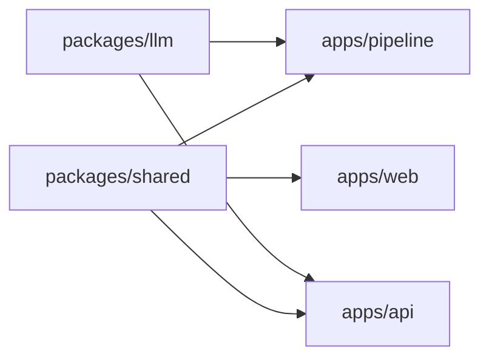

# 코드 아키텍처

- 상태: plan012 구현 완료와 기존 GraphRAG 기준선

이 문서는 **모듈 책임과 의존 방향**을 소유한다.
단계 흐름은 `docs/flow.md`, 데이터 계약은 `docs/data-schema.md` 가 소유한다.

## 스택 제약

| 항목 | 제약 |
| --- | --- |
| 언어 | TypeScript 단일. 파이프라인·API 는 NestJS, 프론트는 React 와 Vite |
| 지식그래프 | Neo4j (docker-compose) |
| 판단 저장소 | Postgres. `packages/registry`가 스키마·repository·service를 소유한다 ([ADR 0005](adr/0005-curation-in-relational-store.md)) |
| LLM | 구독 계정 토큰을 쓰고 종량제 API 는 금지한다 ([ADR 0002](adr/0002-llm-via-subscription-cli.md)).<br>Responses 직접 호출이 기본이고 상주 `codex app-server` 는 되돌리기 경로다 ([ADR 0009](adr/0009-direct-responses-transport.md)) |
| 원천 접근 | 기존 `dooray-cli` 를 자식 프로세스로 호출해 재사용한다. 인증을 다시 구현하지 않는다 |
| 실행 환경 | 로컬 개발 기계 |
| Experience Memory | Markdown 문서와 JSON index. 검색 경로는 filesystem만 사용한다 |
| Memory 추출 모델 | `gpt-5.6-luna`와 low reasoning effort로 고정한다. fallback하지 않는다 |

## 분할 기준

두 기준을 **직교하게** 쓴다.

- **패키지·단계 경계는 기능·역할 도메인으로 가른다** (지식 노드 종류별이 아니다)
- **한 단계 안의 구조는 하는 일로 가른다** — 필요한 단계에만 적용한다

zod 스키마는 `*.schema.ts`, 상수는 `*.const.ts` 로 분리한다.

### 노드 종류별로 나누지 않은 이유

`Task/Wiki/Concept` 별로 모듈을 나누지 않았다.
구조 추출기가 모든 노드를 한 번에 순회하고 적재기도 전 노드를 한 트랜잭션에 MERGE 하기 때문이다.
쪼개면 응집이 깨지고 호출이 얽힌다.

정규화도 같은 성질이다 — 어떤 Concept 을 어느 대표로 합칠지는 **다른 문서들이 그 이름을
몇 번 참조했는지**에 달려 있다. 항목 하나만 보고는 결정할 수 없다.

## 패키지 구성

pnpm workspaces monorepo 다.

```
packages/shared/     온톨로지, API, Concept, Experience Memory 계약
packages/llm/        LLM 호출 전송 — Responses 직접 호출과 상주 app-server, 설정으로 고른다
apps/pipeline/       수집 → 추출 → 적재 CLI
                      Experience evidence → 추출 → Wiki → lexical 검색 CLI
apps/api/            질의응답 REST (NestJS)
apps/web/            React 와 Vite UI
.claude/skills/      저장소 전용 개발·평가 절차와 번들 스크립트
eval/                질문 은행·대표 흐름 평가 세트·평가 리포트
```

의존 방향은 한쪽이다.



`apps/*` 끼리는 서로 의존하지 않는다. 공유가 필요하면 `packages/*` 로 올린다.

**`packages/llm` 은 `packages/shared` 를 의존하지 않는다.** 전송 계층이라 그래프 계약을 모른다.
`apps/web` 도 의존하지 않는다 — Node 자식 프로세스와 WebSocket 을 쓰므로 브라우저에서 돌지 않는다.

평가 실행기는 별도 `apps/*` 패키지로 만들지 않는다.
제품 런타임이 아니라 개발 품질 점검이고, 현재 API 계약만으로 실행할 수 있기 때문이다.
반복 실행에 필요한 결정적 동작은 `kg-eval` 스킬의 `scripts/`에 두고,
평가 방법과 의미 판정 절차는 스킬 본문과 `docs/EVAL-RUBRIC.md`가 소유한다.

ADR 0005가 채택한 판단 저장소는 `packages/registry`가 소유한다.
스키마·repository·service는 이 패키지에 두고, 파이프라인의
`register-project`·`import-curation`·`export-curation` 명령이 진입점을 제공한다.
웹이 import하는 `packages/shared`에는 Node 전용 저장소 클라이언트를 넣지 않는다.

**`packages/shared` 를 고치면 의존 앱을 다시 빌드해야 한다.**
`pnpm --filter api test:unit` 은 shared 를 재빌드하지 않는다.
계약을 바꾸고 테스트하려면 `pnpm --filter @devloop/shared build` 를 먼저 돌린다.

## packages/shared

| 디렉터리 | 소유 |
| --- | --- |
| `ontology/` | 노드 라벨·관계 유형 정의와 방향. 그래프 계약의 단일 소스 |
| `graph/` | 그래프 노드·관계 런타임 타입, 산출물 파일명 상수 |
| `api/` | REST 요청·응답 스키마 |
| `concept/` | Concept 표준 사전 코어 (도메인 무관 기술 용어) |
| `raw/` | 원본 문서 스키마 |
| `memory/` | Experience evidence, Memory, provenance, 검색 응답 계약 |

## packages/registry

Postgres 판단 저장소의 스키마와 읽기·쓰기 계층을 소유한다.
파이프라인은 이 패키지의 공개 함수만 사용하며 SQL과 Drizzle 구현을 직접 알지 않는다.

### repository 는 트랜잭션을 열지 않는다

repository는 행 단위 조회·삽입·삭제만 수행하고, 전달받은 `RegistryExecutor`를 그대로 사용한다.
여러 쓰기를 원자적으로 묶는 경계는 service가 소유한다.
따라서 `curation.service.ts`와 `project.service.ts`만 트랜잭션을 열며 `*.repo.ts`는 열지 않는다.

## packages/llm

LLM 호출의 **전송**을 소유한다. 무엇을 물어볼지는 모르고, 어떻게 보낼지만 안다.

전송이 둘이고 **설정으로 고른다.** 기본은 직접 호출이다.

| 전송 | 무엇을 보내나 | 결정 |
| --- | --- | --- |
| Responses 직접 호출 (기본) | 완성 요청 하나 | [ADR 0009](adr/0009-direct-responses-transport.md) |
| 상주 `app-server` (되돌릴 길) | 에이전트 턴 — 시스템 프롬프트·도구 정의가 함께 간다 | [ADR 0008](adr/0008-persistent-llm-transport.md) |

**둘을 유지하는 이유** — 직접 호출이 쓰는 엔드포인트가 문서화되지 않은 내부 경로다.
바뀌면 설정 하나로 상주 모드로 돌아가야 한다.

| 관심사 | 파일 | 소유 |
| --- | --- | --- |
| 서버 생명주기 | `app-server.process.ts` | `codex app-server` 를 자식으로 띄우고, 준비를 확인하고, 죽인다 |
| JSON-RPC 왕복 | `app-server.client.ts` | `initialize`·`thread/start`·`turn/start` 와 알림 대기 |
| 직접 호출 왕복 | `responses.client.ts` | 요청 조립, SSE 스트림 파싱, 401 판정 |
| 자격증명과 주소 | `responses.credentials.ts` | 어디로 보내고 어떤 헤더를 붙이나. 제공자별로 이것만 갈린다 |
| 조립과 어댑터 계약 | `llm.adapter.ts` | 설정에 맞는 전송을 붙이고 `complete(prompt, opts)`·`close()` 를 낸다 |
| 공개 타입 | `llm.types.ts` | `JsonRpcTransport`·`AppServerHandle`·`LlmTransport` 와 호출 옵션 |
| 공개 표면 | `index.ts` | 위 타입과 `startAppServer`, 어댑터만 내보낸다 |

**추론 강도는 호출자가 명시한다.** 안 넘기면 전송마다 자기 기본값을 써서 전송을 바꿀 때
품질이 조용히 바뀐다 (ADR 0009 가 이 함정을 기록한다).

**토큰 갱신은 이 패키지가 하지 않는다.** 호출할 때마다 `~/.codex/auth.json` 을 읽어
`codex` 가 갱신한 값을 따라가고, 401 이면 즉시 실패시킨다.

**자격증명을 요청 조립에서 떼어 둔다.** 두 경로가 같은 Responses 형식을 쓰고 주소·헤더만 갈린다.

```
responses.credentials.ts  →  { baseUrl, headers }   ← 제공자마다 이것만 다르다
responses.client.ts       →  요청 본문 조립 · SSE 파싱 · 오류 판정  (공유)
```

지금 구현하는 제공자는 ChatGPT 계정 하나다. 종량제 API 제공자는 **만들지 않는다** —
`ADR 0002` 가 금지한다. 그 결정이 바뀌면 이 이음매에 제공자 하나를 더하는 일이 된다.

상주 전송의 세 관심사(생명주기·왕복·조립)가 이 경계 안에 있어야 하는 이유다.

- **서버가 하나에 매달린 자원이다.** 두 앱이 각자 띄우므로 띄우고 죽이는 규칙이 한 곳에 있어야 한다
- **완료 판정이 까다롭다.** `turn/start` 는 즉시 응답하고 완료는 `turn/completed` 알림으로 온다.
  실패도 JSON-RPC 오류가 아니라 그 알림의 `turn.status` 로 온다 — 호출자마다 다시 구현하면 어긴다
- **알림에 `threadId` 와 `turnId` 가 실려 온다.** 동시 호출을 갈라내는 것도 전송의 일이다

**호출마다 새 thread 를 쓴다.** 같은 thread 는 앞 턴을 다음 턴 프롬프트에 남긴다.
`thread/start` 가 0.14초라 새로 만드는 대가는 거의 없다.

## apps/pipeline

단계별 디렉터리다. 디렉터리 이름이 CLI 단계 이름과 대응한다.

| 디렉터리 | 단계 | 책임 |
| --- | --- | --- |
| `fetch/` | `fetch-dooray` | 외부 API 호출과 원본 저장. 가공하지 않는다 |
| `concepts/` | `seed-concepts`·`audit-concepts` | Concept 사전 시드 생성과 정규화 감사 |
| `parse/` | `parse-structure` | 규칙 파싱. 정규식·필드 매핑만 쓴다. 저장 텍스트 상한은 `parse.const.ts`, 훅 댓글 판정과 머리말 제거는 `github-hook-comment.ts` 가 소유한다 |
| `infer/` | `infer-knowledge` | LLM 추출. 캐시·재시도·동시성·관계 검증 |
| `neo4j/` | `sync-neo4j`·`apply-schema` | DB 를 건드리는 것만 모은다 |
| `config/` | — | 환경변수 검증과 주입 |
| `llm/` | — | `packages/llm` 의 전송 어댑터를 파이프라인 설정에 묶는다. Responses가 기본이고 상주·`claude -p` 어댑터도 남는다 |
| `memory/` | `normalize-memory`·`extract-memory`·`build-memory-wiki`·`memory-search` | 세 원천 정규화, Luna 추출, compact Wiki 생성, lexical 검색 |
| `raw-reader.ts` | — | 원본 읽기. `parse` 와 `infer` 가 함께 쓴다.<br>텍스트 추출이 두 종류다 — 참조 추출용(개행을 공백으로 병합)과 저장용(개행 보존) |

`raw-reader.ts` 가 루트에 있는 이유 — 두 단계가 공용으로 쓰므로 한쪽에 넣으면 의존이 역류한다.

### `memory/`는 GraphRAG를 모른다

Experience Memory는 `parsed.jsonl`, `inferred.jsonl`, Neo4j schema를 읽지 않는다.
Dooray raw-reader와 LLM 전송만 재사용하고 별도 evidence와 Memory 계약을 만든다.

```text
apps/pipeline/src/memory/
  evidence-normalizer.ts   세 원천을 evidence packet으로 변환
  dooray-source.ts         업무, 댓글, Wiki segment와 원문 link
  git-source.ts            기본 branch commit, diff, 경험 문서와 원문 link
  experience-extractor.ts  Luna 호출, cache, provenance 검증
  experience-prompt.ts     Experience 전용 추출 지시와 version
  wiki-builder.ts          결정적 Markdown과 JSON index 생성
  lexical-search.ts        tokenization, ranking, scope filter
  cli.ts                   네 operator 명령과 단일 agent 검색 표면
```

각 모듈의 경계는 재실행 비용으로 가른다.
Git과 Dooray 정규화, Wiki build, lexical 검색은 결정적이다.
`experience-extractor.ts`만 LLM을 호출한다.

Git 원천은 `/Users/nhn/projects/OCR` 아래의 저장소를 읽기 전용으로 연다.
수집 중 checkout, fetch, reset, clean을 실행하지 않는다.
현재 working tree branch와 무관하게 `origin/HEAD` revision의 object를 `git show`로 읽는다.

### Memory 모델 강제 위치

Memory model은 환경변수 기본값이 아니다.
Memory 도메인의 상수 `gpt-5.6-luna`를 호출 옵션에 직접 전달하고, 다른 model 인자를 받지 않는다.
provider가 Codex가 아니거나 모델을 사용할 수 없으면 호출 전에 또는 첫 호출에서 실패한다.
Experience structured output request schema는 Responses가 지원하는 JSON Schema 키만 싣는다.
빈 문자열과 `sourceRefKeys` 중복은 request schema가 아니라 Zod post-validation에서 거부한다.

일반 GraphRAG의 `LLM_MODEL`과 `QUERY_LLM_MODEL`은 기존 비교군의 설정으로 남는다.
Memory 경로가 두 값을 fallback으로 읽지 않는다.

### Agent 검색 표면

첫 구현은 HTTP endpoint나 MCP server를 추가하지 않는다.
`memory-search` CLI가 JSON 한 번으로 결과와 측정값을 반환한다.
Claude Code와 Codex 사용 지침은 같은 명령을 가리키며 저장 구조를 노출하지 않는다.

두 지침의 voluntary policy는 동일한 marker 구간으로 유지하고 테스트에서 바이트 동등을 검사한다.
검색 구현은 Agent별 adapter를 만들지 않는다.
평가 runner만 Codex JSONL과 Claude stream-json을 각각 telemetry event로 정규화한다.

**원천 형식에 종속된 판정 규칙은 전용 모듈로 뺀다.** GitHub 훅 댓글 판정과 머리말 제거가 그 예다.
`structural-extractor.ts` 안에 정규식으로 섞어 두면 세 가지가 나빠진다.

- 규칙이 좁은지 넓은지 눈으로 확인하기 어렵다. 넓게 잡아 사람 댓글 40건의 내용을 깎을 뻔했다 (최대 699자)
- 훅 종류가 늘거나 다른 서비스가 붙을 때 손댈 자리가 흩어진다
- 규칙 단위 테스트를 붙일 대상이 없어, 오탐이 생겨도 어디를 고칠지 드러나지 않는다

### 설정은 단계 함수에 인자로 내려간다

파이프라인도 API 와 같이 검증된 설정 객체를 쓴다 ([ADR 0003](adr/0003-fail-fast-config.md)).
`main.ts` 가 이미 Nest 애플리케이션 컨텍스트를 띄우므로 새 장치가 아니다.

단계 명령들은 DI 밖 평범한 함수이므로 **설정을 인자로 받는다.**
전역 접근을 남기면 어느 값이 어디서 쓰이는지 다시 흩어져 이관의 의미가 없다.

### `neo4j/sync.ts` 를 875줄에서 303줄로 줄였다

적재 단계 안에 성격이 다른 관심사가 섞여 있었다.

| 관심사 | 규모 | 처리 |
| --- | --- | --- |
| 입력 읽기 (`jsonl`·사전) | 약 60줄 | `resolve/io.ts` 로 옮겼다 |
| **정규화** (별칭 치환·엔드포인트 해석·노드 병합) | **약 340줄** | `resolve/` 로 옮겼다. Neo4j 의존이 0이었다 |
| Neo4j 쓰기 (MERGE) | 약 160줄 | 남았다 |
| 일회성 마이그레이션 | 약 20줄 | 삭제했다. 매 적재마다 조건 없이 실행되고 있었다 |
| 통계 수집·오케스트레이션 | 약 100줄 | 남았다 |

경계를 흐리던 것 둘도 함께 사라졌다.

- **적재가 추출 산출물을 덮어썼다** — 적재 중 관계 정리기가 `inferred.jsonl` 을 `writeFile` 했다.
  정리가 순수 함수로 메모리에서 돌게 되어 파일 출력은 `resolve-graph` 단독 실행 때만 일어난다
- **사전 로딩이 두 곳에 각자 있었다** — 생성 사전과 판단 합성을 `concepts/dictionary.ts`로 모았다.
  `infer`와 `resolve/io.ts`가 같은 로더를 사용한다

정규화가 적재에 묶여 있어 **별칭을 바꿨을 때 효과를 적재 없이 볼 수 없었다.**
적재기가 MERGE 전용이라 틀리면 그래프를 초기화해야 했다.

### `resolve/` 가 그 정규화를 갖는다

정규화는 순수 함수이고, 그 결과를 파일로 내놓는 `resolve-graph` 명령이 있다.
`sync-neo4j` 는 그 파일을 읽지 않고 같은 순수 함수를 직접 부른다. 결정과 근거는
`docs/adr/0004-resolve-as-inspection-stage.md` 에 있다.

```
apps/pipeline/src/
  resolve/                   Neo4j 를 모른다. 파일과 순수 함수만 다룬다
    resolve.ts               단계 진입점과 resolveGraph
    resolve.schema.ts        ResolveResult zod 계약
    concept-alias.ts         사전 → 별칭 맵
    endpoint.ts              엔드포인트 색인·해석
    node-merge.ts            노드 병합·미매칭 Concept 대표 선정
    io.ts                    입력 읽기·resolved.jsonl 쓰기
  neo4j/
    sync.ts                  Neo4j 쓰기만 (875 → 303줄)
    reset.ts                 그래프 초기화 (--force 필수, NEO4J_URI 필수, 운영 포트는 --allow-production 도 필수)
```

`resolve/` 를 `neo4j/` 밖에 두는 이유 — Neo4j 를 모르기 때문이다. 디렉터리 이름이 그 사실을 말해야 한다.

정규화를 4개 파일로 가른 기준은 **전역 시야가 필요한 단위**다.

| 파일 | 전역 시야 |
| --- | --- |
| `concept-alias.ts` | 사전 전체 |
| `endpoint.ts` | 전체 노드 — 색인을 만들어야 관계 양끝을 해석한다 |
| `node-merge.ts` | 전체 노드·관계 — 참조 수를 세어 대표를 고른다 |
| `resolve.ts` | 위 셋을 순서대로 흘린다 |

**더 쪼개지 않는다.** 정규화도 위의 "노드 종류별로 나누지 않은 이유" 와 같은 성질이다 —
어떤 Concept 을 어느 대표로 합칠지는 다른 문서들이 그 이름을 몇 번 참조했는지에 달려 있다.

함께 정리한 것이다.

- **사전 로딩 중복 제거** — 적재 쪽 구현을 `io.ts` 의 `readResolveInput` 한 곳으로 모았다
- **정리 함수 순수화** — 파일을 덮어쓰던 함수 아래에 순수 함수를 깔고 둘이 같은 로직을 쓰게 했다.
  `sync-neo4j` 는 순수 함수만 쓰므로 적재가 `inferred.jsonl` 을 덮어쓰지 않는다
- **죽은 마이그레이션 삭제** — 적재기가 만들지 않는 상태를 고치려던 코드였다 (실측 근거는 ADR 0004)
- **인자 파싱 공용화** — `readFlag` 와 `readDataDirFlag` 를 `cli-options.ts` 로 올렸다.
  `--data-dir` 우선순위를 한 곳에 두어 `resolve-graph` 와 `sync-neo4j` 가 같은 데이터를 본다

## apps/api

NestJS 다. 도메인별 디렉터리로 나뉜다.

| 디렉터리 | 책임 |
| --- | --- |
| `config/` | 환경설정 zod 검증. **필수 값이 없으면 기동을 실패시킨다** |
| `query/` | 질의응답 — 앵커 검색, Cypher 생성, 근거 정제, 답변 합성 |
| `graph/` | 그래프 조회 엔드포인트 (통계·검색·표본·이웃) |
| `ontology/` | 온톨로지 계약 노출 |
| `neo4j/` | 드라이버·세션 관리 |
| `llm/` | `packages/llm` 의 전송 어댑터를 Nest DI 에 묶는다. Responses가 기본이고 상주·`claude -p` 어댑터도 남는다 |

루트에 1줄 재export 파일이 몇 개 있다 (`llm-cli.ts`·`neo4j.service.ts`·`ontology.controller.ts`).
도메인 이동 과정의 호환 계층이다.

`graph-query.service.ts` 는 조회 4종만 담고, 전문 검색은 `query` 도메인에 위임한다 —
질의응답 앵커 검색과 같은 의미를 써야 하므로 구현을 복제하지 않았다.

그래서 검색 대상 인덱스를 늘리면 `/api/graph/search` 결과도 함께 바뀐다. 화면 검색에
`Comment` 노드가 섞여 나오므로, 목록에 쓰는 표시 문자열은 짧게 자른다. 저장한 본문은 길게
두되 사람이 훑는 목록에는 앞부분만 보인다.

표시 상한은 `apps/api/src/neo4j/neo4j.const.ts` 의 `COMMENT_DISPLAY_LIMIT` 가 소유한다.
자르는 대상은 `display` 뿐이고 근거 노드의 `excerpt` 속성은 그대로 길어야 답변이 인용할 수 있다.

### 질의 도메인의 알려진 한계

끝난 측정이 아니라 **지금도 살아 있는 제약**이다. 이 영역을 건드리기 전에 읽는다.

**앵커 선정이 취약하다.**

- **원문 유실** — 프롬프트가 한·영 표기 변형을 만들라고 지시하는데 LLM 이 원문을 버리고 변형만 넣는다.
  실측으로 "Log & Crash 쓰는 법" 에서 `로그` 만 추출해 엉뚱한 Concept 을 앵커로 잡았다.
  `Log & Crash` 로 검색하면 정답 위키가 4위로 나오므로 인덱스 문제가 아니다
- **최종 슬롯 경쟁** — 전문 검색은 **인덱스당** 8건씩 따로 가져오고, 공유되는 것은 그 뒤
  `rankAnchorCandidates` 가 고르는 최종 8개다. 라벨 정원(Task 최대 5·Wiki 최소 2·Concept 최대 2)이
  일부 완화하지만 후보 풀이 인덱스 5개로 늘어 압력은 커졌다

**Concept 파편화 중 표기 정규화로 잡히지 않는 유형이 남아 있다.**

| 유형 | 예 |
| --- | --- |
| 부분 표기 | `Log`·`Crash` 대 `NHN Cloud Log & Crash` |
| 접두어 차이 | `api gateway` 대 `OCR API Gateway` |

부분포함으로 탐지하면 1,247쌍이 나오지만 **대부분 오탐**이다 — `Document` 가 `Document.Console` 에
포함되지만 둘은 별개 개체다. 그래서 자동 병합을 하지 않고 사람이 확인해 판단으로 등록한다
([ADR 0005](adr/0005-curation-in-relational-store.md)).

### 근거 예산은 세 상수가 나눠 갖는다

`apps/api/src/query/query.const.ts` 가 소유한다. 개수가 아니라 **직렬화 길이**로 자르는 이유는
본문 상한이 6,000자로 오른 뒤 노드 하나의 비용이 30배까지 벌어졌기 때문이다.

| 상수 | 무엇을 지키나 |
| --- | --- |
| `EVIDENCE_SERIALIZED_BUDGET` | 응답에 담는 근거의 직렬화 길이 |
| `EVIDENCE_NODE_CEILING` | 화면이 그릴 수 있는 노드 개수 |
| `ANSWER_EVIDENCE_PROMPT_BUDGET` | 답변 합성 프롬프트에 담는 근거 |
| `ANSWER_EVIDENCE_RELATIONSHIP_RESERVE` | 그 예산 중 관계에 예약하는 몫 |

**응답 예산이 프롬프트 예산보다 크다.** 회수는 응답을 기준으로 판정하므로 프롬프트 사정에 맞춰
응답을 줄이면 측정이 제품보다 좁아진다.

프롬프트 쪽은 노드를 하나씩 담아 예산에 맞춘다. 직렬화 결과를 문자 단위로 자르면 JSON 구조
중간이 잘려 LLM 이 닫히지 않은 조각을 받는다.

**노드에 예산을 먼저 준다.** 관계 비용을 전부 먼저 빼면 관계가 예산을 넘는 회차에서 노드 예산이
0이 되어 첫 노드만 담기고, 그 뒤 관계도 끝점이 없어 전부 걸러진다. 예산을 관계에 예약해 놓고
관계까지 버리는 이중 낭비다. 그래서 관계에는 일부만 예약하고 노드를 담은 뒤 남은 여유로 채운다.

예산 때문에 빠진 수는 `omittedNodes`·`omittedRelationships` 로 프롬프트에 함께 알린다.
관계가 비어 있는 것을 "관계가 없다" 로 읽으면 관계 주장이 필요한 문항에서 오답이 된다.

### 설정이 기동을 실패시키는 이유

값이 없을 때 조용히 기본값으로 도는 구조에서 사고가 났다.
`.env` 에 질의 모델이 지정돼 있었지만 API 가 그 파일을 읽지 않아, CLI 기본 모델로 질의가 돌았다.
문서에 확정됐다고 적힌 모델이 아니었다.

- 필수 값이 없으면 `exit 1` 로 죽는다. 부재를 즉시 드러나는 실패로 바꿨다
- 다른 값들은 코드 기본값이 `.env` 와 우연히 같아 드러나지 않았다. **우연한 일치가 가장 위험하다**

자세한 결정은 `docs/adr/0003-fail-fast-config.md` 에 있다.

## apps/web

React 와 Vite 다. 화면 4종이다.

| 화면 | 역할 |
| --- | --- |
| 질의응답 | 질문 입력, 답변, 근거 서브그래프 하이라이트 |
| 온톨로지 정의 | 노드 라벨·관계 유형 계약 조망 |
| 스키마 맵 | 라벨·관계별 표본 탐색 (페이징) |
| 인스턴스 탐색 | 노드 검색과 이웃 확장 |

**Vite 는 워크스페이스 의존성 변경으로 사전 번들 캐시를 무효화하지 않는다.**
`packages/shared` 를 다시 빌드하면 웹이 옛 캐시를 물어 named export 가 사라진다.
`dev` 스크립트에 `--force` 를 붙여 막았다.

## 평가 스킬

기존 사람형 평가와 AI 에이전트형 평가에 중복돼 있던 실행·채점 절차는 `kg-eval` 하나로 합친다.
사람형 질문과 AI 에이전트형 질문은 별도 애플리케이션이 아니라 같은 평가의 `audience` 분류다.

```text
.claude/skills/kg-eval/
├── SKILL.md
├── references/
│   └── result-contract.md
└── scripts/
    ├── run.mjs
    ├── compare.mjs
    └── validate-suite.mjs

eval/
├── questions-human-tc-ocr.json
├── questions-ai-tc-ocr.json
├── suites/
│   └── tc-ocr-api-gateway.json
├── runs/                         커밋하지 않는 원시 응답
└── reports/                      비교 가능한 요약 JSON·Markdown
```

스크립트는 Node.js 기본 기능만 사용한다.
새 패키지나 서버 엔드포인트를 추가하지 않고 기존 `/api/graph/*`와 `/api/query`를 호출한다.
`run.mjs`는 사전 점검, 직렬 반복 실행, 재개, 원시 결과 기록을 맡는다.
`validate-suite.mjs`는 원천 참조와 평가 세트 형식을 검사한다.
`compare.mjs`는 두 리포트의 문항·축별 회귀만 비교한다.

`kg-model-bench`는 모델 선택이라는 별도 관심사를 유지한다.
검색 품질 측정이 필요할 때 `kg-eval` 결과를 재사용하며 자체 채점 규칙을 복제하지 않는다.

Coding Agent Memory 평가는 같은 skill 안에서 다음 책임으로 분리한다.

```text
.claude/skills/kg-eval/scripts/memory/
  suite.mjs          public suite와 private source lock 검증
  workspace.mjs      pinned Git object를 ignored 평가 workspace로 materialize
  condition.mjs      no-memory, voluntary, oracle, graph, automatic 입력 구성
  agent-runner.mjs   Codex·Claude 실행과 timeout·종료 처리
  telemetry.mjs      turn, tool, source read, memory call, token 관측 정규화
  judge.mjs          validation, wrong edit, rework 판정
  result.mjs         재개 조건과 원자적 raw result 저장
```

entrypoint는 이 모듈을 조합할 뿐 판정 규칙을 다시 구현하지 않는다.
실제 내부 원문, repository path, revision, Agent 전문은 ignored `eval/runs/`에만 둔다.
커밋하는 suite는 task 분류와 안정 ID를, report는 hash와 집계만 보존한다.

retrieval과 Graph 비교 adapter는 production `memory-search`를 바꾸지 않는다.
SQLite FTS는 Node 내장 `node:sqlite`를 사용하고, embedding은 격리 adapter가 availability와 운영 비용을 함께 보고한다.
Graph adapter는 source-backed 이웃 조회를 사용하며 Memory 추출 입력이나 자동 production 경로로 연결하지 않는다.

## 테스트 배치와 함정

| 위치 | 대상 |
| --- | --- |
| `apps/pipeline/src/**/*.test.ts` | 단위 (빌드 산출물로 실행) |
| `apps/pipeline/test/*.test.cjs` | 통합 (fixture 기반) |
| `apps/api/test/*.test.js` | 단위·계약 |
| `apps/api/test/api.e2e.test.js` | e2e (별도 Neo4j 인스턴스) |

세 가지가 조용히 무력화될 수 있다.

- `pnpm --filter api test` 는 `test` 스크립트가 없으면 **exit 0 으로 통과**한다. `test:unit` 을 쓴다
- `apps/pipeline` 의 test glob 이 경로를 열거하는 방식이라 새 디렉터리는 자동으로 잡히지 않는다
- e2e 는 **컨테이너 기동 실패와 테스트 실패가 구분되지 않아** 결함이 오래 숨을 수 있다.
  fixture 소스 파일명이 적재기 기대와 어긋나 예외로 죽고 있었는데, 기동 단계에서 먼저 막혀
  예외까지 도달조차 못 했다

통과 표시가 아니라 **테스트 개수**를 확인한다.
