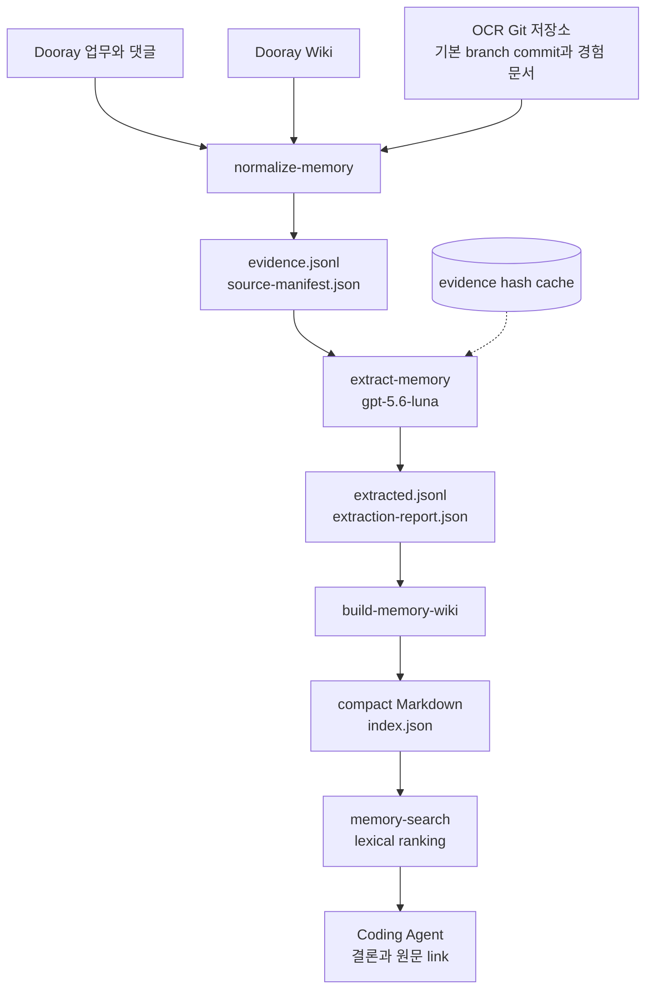
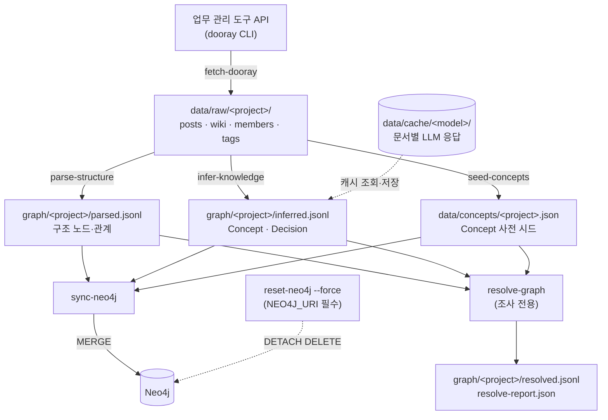
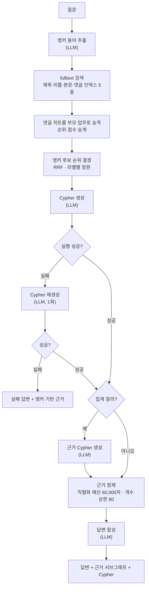
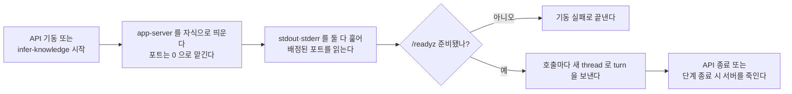
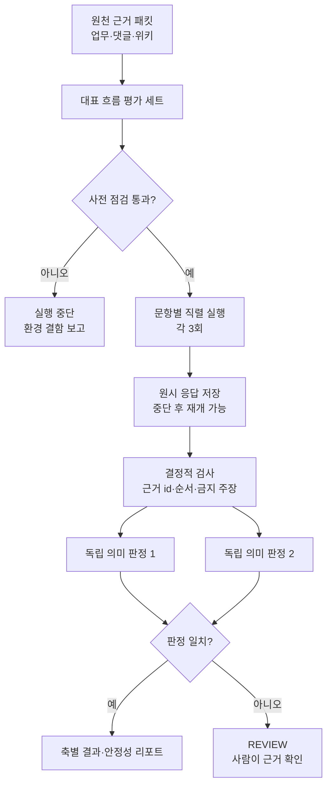

# 흐름 — Experience Memory와 GraphRAG

- 상태: plan012 목표 상태와 기존 GraphRAG 기준선

이 문서는 **무엇이 어디로 흐르는가**를 소유한다 — 단계 순서, 상태 전이, 실패와 부분 성공이다.
모듈 배치는 `docs/code-architecture.md`, 데이터 형식은 `docs/data-schema.md` 가 소유한다.

## Experience Memory 흐름

Experience Memory는 기존 GraphRAG와 별도 파일 체인으로 동작한다.
GraphRAG를 제거하거나 그 산출물을 입력으로 사용하지 않는다.



### Memory 단계별 계약

| 단계 | 입력 | 출력 | 성격 | 재실행 비용 |
| --- | --- | --- | --- | --- |
| `normalize-memory` | 최신 Dooray raw, Git 기본 branch | evidence와 source manifest | 결정적 | Git 읽기와 파일 생성 |
| `extract-memory` | evidence | Experience draft와 report | LLM | cache miss packet 수만큼 Luna 호출 |
| `build-memory-wiki` | 검증된 draft | Markdown과 JSON index | 결정적 | 파일 생성 |
| `memory-search` | query, 선택 scope, index | 상위 Memory JSON | 결정적 | index 선형 탐색 |

Dooray 최신화는 기존 `fetch-dooray`가 소유한다.
`normalize-memory`는 원천을 직접 호출하지 않고 고정된 raw snapshot을 읽는다.
Git은 각 저장소의 `origin/HEAD`를 우선하고 없으면 현재 HEAD를 사용하며, 선택한 revision을 manifest에 기록한다.

### 원문 link

업무와 댓글은 raw 업무의 전역 ID로 `/project/tasks/{id}` 링크를 만든다.
Wiki는 raw 페이지 ID로 `/project/pages/{id}` 링크를 만든다.
댓글은 고유 ID를 provenance로 유지하면서 부모 업무 링크로 원문을 연다.

Git commit은 원격 URL과 SHA로 `/commit/{sha}` 링크를 만든다.
현재 경험 문서는 pinned revision과 경로로 `/blob/{sha}/{path}` 링크를 만든다.
URL은 이동할 수 있으므로 `sourceType`과 `sourceId`를 별도 식별자로 유지한다.

### 실패, 빈 상태, 동시 실행

| 상황 | 처리 |
| --- | --- |
| Dooray raw 없음 | 정규화를 시작하지 않고 실패 |
| Git root 없음 또는 저장소 0개 | 필수 원천 누락으로 실패 |
| Git 저장소 하나를 읽지 못함 | 해당 저장소와 오류를 report에 남기고 전체 정규화 실패 |
| 모델이 `gpt-5.6-luna`가 아님 | LLM 호출 전에 실패 |
| Luna 호출 일부 실패 | 성공분과 실패 report를 저장하지만 index를 incomplete로 표시 |
| incomplete index 검색 | 기본 거부, 조사 목적의 명시 옵션에서만 허용 |
| 검색 결과 0건 | 정상 응답으로 빈 `results`와 검색 측정값 반환 |
| build 동시 실행 | lock을 먼저 얻은 실행만 진행하고 나머지는 실패 |

각 파일은 임시 파일에 완전히 쓴 뒤 rename한다.
중단된 실행이 기존 정상 index를 부분 파일로 덮지 않게 한다.

### Coding Agent 호출

Coding Agent가 기억해야 하는 명령은 `memory-search` 하나다.
Agent가 Memory 필요 여부와 query를 판단하며, 저장 방식이나 kind별 API를 알 필요가 없다.

기본 사용은 한 번의 검색으로 끝난다.
결과의 confidence가 낮거나 status가 `uncertain`이거나 현재 source와 충돌할 때만 원문 link를 추가로 연다.

## 파이프라인 — 파일로 이어진 배치 체인

각 단계가 결과를 **파일로 떨어뜨리고** 다음 단계가 그 파일을 읽는다. 메모리를 공유하지 않는다.



`resolve-graph` 는 체인 위가 아니라 **옆에** 붙는다.
`sync-neo4j` 는 `resolved.jsonl` 을 읽지 않고 같은 순수 함수를 직접 부른다 — 그래서 stale 이 없다.
근거는 `docs/adr/0004-resolve-as-inspection-stage.md` 에 있다.

## 단계별 계약

| 단계 | 입력 | 출력 | 재실행 비용 | Concept 사전 |
| --- | --- | --- | --- | --- |
| `fetch-dooray` | 외부 API | `data/raw/` | 네트워크. 원본 API 가 살아 있어야 한다 | 안 쓴다 |
| `seed-concepts` | `data/raw/`·기존 사전·판단 저장소 | `data/concepts/` | 공짜 | 만든다 |
| `parse-structure` | `data/raw/` | `graph/parsed.jsonl` | **공짜** (수 초) | 안 쓴다 |
| `infer-knowledge` | `data/raw/` 와 사전 | `graph/inferred.jsonl` | **문서 수만큼 LLM 호출** | 읽는다 |
| `sync-neo4j` | 위 셋과 `NEO4J_URI` | Neo4j | 되돌리기 어렵다 | 읽는다 |

체인 밖 명령이다. 파이프라인을 흘리지 않고 상태를 조작하거나 관찰한다.

| 명령 | 성격 |
| --- | --- |
| `resolve-graph` | 정규화 결과를 파일로 내놓는다 (읽기 전용, 조사용). Concept 사전을 읽는다 |
| `apply-schema` | Neo4j 제약·인덱스 적용. `NEO4J_URI` 필수 |
| `reset-neo4j` | 그래프 전체 삭제. `NEO4J_URI`·`--force` 필수, 운영 포트(`7687`)는 `--allow-production` 도 필요 |
| `audit-concepts` | Concept 정규화 감사 (읽기 전용). `NEO4J_URI` 필수 |

`seed-concepts` 는 기존 사전 항목을 모두 보존하므로 사전은 자동으로 줄어들지 않는다.
원천에서 사라진 항목을 정리하는 명령은 아직 없으며, 필요해질 때 별도 판단으로 추가한다.

ADR 0005의 판단 저장소는 `register-project`·`import-curation`·`export-curation` 명령으로 조작한다.

### 사전을 읽는 단계가 판단 저장소를 조회한다

`seed-concepts`·`infer-knowledge`·`resolve-graph`·`sync-neo4j`는 파일 사전과 관계형 판단 저장소를 합성해 읽는다.
판단 저장소 접속 정보가 없거나 조회가 실패하면 판단 0건으로 바꾸지 않고 명령을 실패시킨다.
테스트는 빈 판단을 명시적으로 주입할 수 있다.

`fetch-dooray`와 `parse-structure`는 판단 저장소를 건드리지 않아 기존 오프라인 성질을 유지한다.

### 두 호출 경로가 같은 순수 함수를 공유한다

```
resolve-graph:  읽기 → 정리 → 정규화 → 파일 쓰기
sync-neo4j:     읽기 → 정리 → 정규화 → Neo4j 쓰기
```

앞 세 단계가 같은 함수다. 갈리는 것은 마지막 출력뿐이다.

**같은 입력이면 `resolved.jsonl` 이 바이트 동등해야 한다.** 그게 별칭 변경 전후 비교의 전제다.
출력 순서를 고정한다 — 노드는 `라벨 → 키 → tie-break`, 관계는 `유형 → 시작키 → 끝키 → tie-break` 다.
tie-break 는 파일에 실제로 쓰는 직렬화 바이트(`JSON.stringify` 결과) 자체다.

## 단계 경계를 가른 기준 — 재실행 비용

비용이 다른 것을 한 단계에 묶으면 **싼 것을 고치려고 비싼 것을 다시 돌리게 된다.**

- `parse-structure` 는 규칙 파싱이라 공짜다. 참조 패턴을 고쳐도 LLM 비용이 0이다
- `infer-knowledge` 는 문서 수만큼 LLM 을 부른다. 캐시 키가 `문서 id + 모델 + 추론 강도 + promptVersion` 이라
  **추출 프롬프트나 추론 강도를 고치면 캐시가 전부 빗나가 전량 재호출된다**
- 파이프라인 추론 강도는 의도적으로 미지정(`default`)을 유지한다. 강도를 명시하면 기존 캐시 537건이
  전부 빗나간다. 재추출할 때 강도를 정하고 캐시 무효화를 감수해야 한다
- `sync-neo4j` 는 되돌리기 어렵다. 적재기가 MERGE 전용이라 삭제 경로가 없다

이 차이가 이름에 드러나야 한다. 이전 이름(`extract:structural`·`extract:llm`)은 둘 다 `extract:` 라서
비용 차이를 숨겼다.

추출 시간 추정이다. 관리 대상은 비용이 아니라 **시간**이다 ([ADR 0002](adr/0002-llm-via-subscription-cli.md)).

| 조건 | 시간 |
| --- | --- |
| 537문서 순차 (호출당 20~40초) | 3~6시간 |
| 동시 실행 4 | 약 1~1.5시간 |

캐시가 있어 중단 후 재실행은 남은 문서만 처리한다. rate limit 에 닿으면 백오프로 감속한다.

## 질의응답 흐름



**근거는 두 곳에서 각각 예산을 받는다.** 응답에 담는 예산(60,000자·80건)과 답변 합성 프롬프트에
담는 예산(20,000자)이 다르다. 프롬프트 쪽은 **노드를 하나씩 담아** 맞춘다 — 직렬화 결과를 문자
단위로 자르면 JSON 구조 중간이 잘려 LLM 이 닫히지 않은 조각을 받는다.

응답 예산이 프롬프트 예산보다 크다. 근거 회수는 응답 기준으로 판정하므로, 프롬프트 사정에
맞춰 응답을 줄이지 않는다.

LLM 호출은 질의 1건당 **3~5회**다.

| 호출 | 조건 |
| --- | --- |
| 앵커 용어 추출 | 항상 |
| Cypher 생성 | 항상 |
| Cypher 재생성 | 실행 실패 시에만 |
| 근거 Cypher 생성 | 집계 질의일 때만 |
| 답변 합성 | 항상 |

**형식 위반으로 같은 요청을 다시 보내는 경로는 없다.** JSON 계약 재시도 루프를 제거했다
([ADR 0008](adr/0008-persistent-llm-transport.md)).

형식을 무엇이 보장하는지는 전송에 따라 다르다.

| 전송 | 형식 보장 | 위반 시 |
| --- | --- | --- |
| Responses 직접 호출 | `text.format.json_schema` | 드물지만 zod 검증이 즉시 오류로 올린다 |
| 상주 `app-server` | `turn/start` 의 `outputSchema` | 드물지만 zod 검증이 즉시 오류로 올린다 |
| `claude` (자식 프로세스) | 없다 — 실을 통로가 없다 | zod 검증이 즉시 오류로 올린다 |

스키마가 있어도 검증을 남긴 이유다 — **모양만 보장하고 내용은 보지 않는다** (ADR 0008).

두 경우 모두 재시도하지 않는다. 검증 실패를 재시도로 덮으면 계약 결함이 드러나지 않는다.

### LLM 전송을 고르는 규칙

전송이 셋이고 설정이 고른다. 기본은 직접 호출이다 ([ADR 0009](adr/0009-direct-responses-transport.md)).

| 설정 | 전송 | 무엇이 필요한가 |
| --- | --- | --- |
| 기본 | Responses 직접 호출 | `~/.codex/auth.json` 의 계정 토큰. 띄울 프로세스가 없다 |
| 상주로 전환 | `codex app-server` | 자식 프로세스와 준비 확인 (아래 절) |
| `LLM_PROVIDER=claude` | `claude -p` 자식 프로세스 | 호출마다 프로세스를 띄운다 |

**직접 호출은 아무것도 띄우지 않는다.** 그래서 아래 생명주기는 상주 전송을 골랐을 때만 적용된다.

**추론 강도는 설정에서 명시한다.** 안 넘기면 전송마다 자기 기본값을 써서, 전송을 바꿀 때
지연·품질 변화의 원인을 가를 수 없다.

### 상주 전송을 골랐을 때의 서버 생명주기

`LLM_PROVIDER` 가 `codex` 이고 전송이 상주일 때만 서버를 띄운다.
`claude` 면 자식 프로세스 어댑터를 쓰므로 서버가 없다. 서버는 **부르는 쪽이 자기 것을 갖는다.**

**서버의 수명이 두 앱에서 다르다.**

| 앱 | 띄우는 시점 | 죽이는 시점 |
| --- | --- | --- |
| `apps/api` | 프로세스 기동 (`useFactory`) | 프로세스 종료 (NestJS 종료 훅) |
| `apps/pipeline` | `infer-knowledge` 단계 시작 | 그 단계 종료 (`finally`) |

파이프라인의 다른 단계(`fetch-dooray`·`seed-concepts`·`parse-structure`·레지스트리 명령)는
LLM 을 쓰지 않으므로 서버를 아예 띄우지 않는다.



API 와 파이프라인이 동시에 돌면 서버도 둘이다. 하나를 공유하지 않는 이유는 ADR 0008 에 있다 —
누가 죽이는지가 모호해지고, 떠 있는 서버가 이상해졌을 때 붙는 쪽이 원인을 모른다.

서버에 넘기는 실행 조건이다. 모델이 저장소를 읽기만 하고 승인을 기다리지 않게 한다.

| 인자 | 값 |
| --- | --- |
| `cwd` | 저장소 루트 |
| `sandbox` | `read-only` |
| `approvalPolicy` | `never` |
| `ephemeral` | `true` |

## 실패와 부분 성공

파이프라인과 질의응답 모두 **부분 성공을 허용한다.** 한 건이 실패해도 전체를 중단하지 않는다.

| 지점 | 실패 처리 |
| --- | --- |
| `fetch-dooray` 개별 문서 | 실패 목록을 출력하고 exit 1. 수집은 전량 성공을 요구한다 |
| `infer-knowledge` 개별 문서 | 실패를 `inference-failures.json` 에 집계하고 나머지를 계속 진행한다 |
| `infer-knowledge` 관계 검증 | 스키마에 없는 관계는 버리고 `inference-dropped-relationships.json` 에 기록한다 |
| `sync-neo4j` 관계 적재 | 끝점 노드가 없으면 건너뛰고 집계한다. 단 구조 관계는 예외로 중단한다 |
| 질의 Cypher 실행 | 1회 재생성한다. 그래도 실패하면 앵커 기반 근거로 답한다 |
| 질의 답변 합성 | 실패하면 근거 요약으로 대체 답변을 만든다 |
| 댓글 히트 승격 | 부모 업무를 못 찾으면 그 히트를 버린다. 앵커 목록에 `Comment` 를 남기지 않는다 |
| 댓글 히트 승격 단계 자체 실패 | 부모 조회가 예외를 던지면 `Comment` 히트만 버리고 나머지 결과로 진행한다.<br>원본으로 되돌리지 않는다 — 되돌리면 `Comment` 가 라벨 정원 없이 앵커 슬롯을 잠식한다 |
| 훅 머리말 벗기기 | 벗긴 뒤 내용이 없으면 원문을 유지한다 |
| 저장 상한 초과 | 6,000자로 자르고 잘린 건수를 `parse-structure` 요약에 출력한다.<br>조용한 손실이 되지 않게 하는 것이 목적이다 |
| LLM 전송 서버 기동 | 준비 확인에 실패하면 **기동을 실패시킨다.** 부분 성공을 허용하지 않는다 —<br>서버 없이 뜬 API 는 모든 질의가 실패하므로 늦게 드러날 뿐이다 ([ADR 0003](adr/0003-fail-fast-config.md)) |
| LLM 턴 실패 | `turn/completed` 의 `turn.status` 가 `failed` 면 그 호출을 실패로 올린다.<br>JSON-RPC 응답만 보면 성공으로 읽히므로 상태를 반드시 확인한다 |
| 직접 호출 인증 만료 | 401 이면 **즉시 실패시킨다.** 오류에 `codex` 를 한 번 실행해 토큰을 갱신하라고 담는다.<br>갱신을 우리가 시도하지 않는다 — 자격증명을 다루는 코드를 늘리지 않는다 |
| 직접 호출 스트림 오류 | SSE 에서 오류 이벤트가 오거나 최종 텍스트가 비면 그 호출을 실패로 올린다.<br>빈 문자열을 정상 응답으로 넘기면 계약 검증이 엉뚱한 곳에서 터진다 |

**구조 관계만 중단시키는 이유** — 규칙 파싱은 결정적이라 끝점이 없으면 파싱 결함이다.
LLM 추출은 비결정적이라 일부 실패가 정상 범위다.

## 평가 흐름

평가는 제품 기능이 아니라 저장소 안의 `kg-eval` 스킬이 수행하는 개발 절차다.
평가 스킬은 현재 질의 API를 읽기 전용으로 호출하며 그래프나 원천 데이터를 바꾸지 않는다.



문항은 원천에서 먼저 정답을 만들고 그래프를 보며 정답을 고치지 않는다.
각 문항은 다음 네 경계를 따로 판정한다.

1. 원천에 답할 근거가 있는가.
2. 필요한 노드와 관계가 그래프에 있는가.
3. 질의 응답의 근거에 필요한 항목이 들어왔는가.
4. 답변이 원인·결정·조치·검증의 흐름을 과장 없이 재구성했는가.

원천에 직접 연결 근거가 없는 문항은 검색 실패로 세지 않는다.
이 문항은 관계를 지어내지 않고 근거 부족을 답하는지 확인하는 음성 대조로 쓴다.

동시에 여러 질의를 보내면 응답 변동의 원인이 실행기인지 질의 엔진인지 구분하기 어렵다.
그래서 한 평가 실행 안에서는 문항을 직렬로 처리한다.
완료된 시도는 원시 결과에 남겨 중단 후 다시 시작할 때 건너뛴다.

## 되돌리기

| 상황 | 방법 |
| --- | --- |
| 파일 산출물을 다시 만들고 싶다 | 해당 단계만 다시 돌린다. 앞 단계 산출물은 그대로 쓴다 |
| 그래프 노드를 줄이고 싶다 | 같은 `NEO4J_URI`로 `reset-neo4j --force` → `apply-schema` → `sync-neo4j`. **세 명령 모두 같은 URI 를 가리켜야 한다** — 인라인 지정은 첫 명령에만 적용되므로 `export NEO4J_URI=...` 로 셸에 남긴다. **초기화 없이는 줄지 않는다** |
| 추출 결과를 갱신하고 싶다 | 프롬프트를 고치면 `promptVersion` 을 올려야 캐시가 무효화된다 |

## 상태가 아닌 것

이 시스템에 **증분 상태가 없다.** 수집·추출·적재가 매번 전량을 다룬다.
그래서 "어디까지 처리했나" 를 추적하는 상태 저장소가 없고, 중단 후 재개도 파일 단위로만 이루어진다.

`fetch-dooray` 만 예외로 이미 받은 파일을 건너뛴다.
