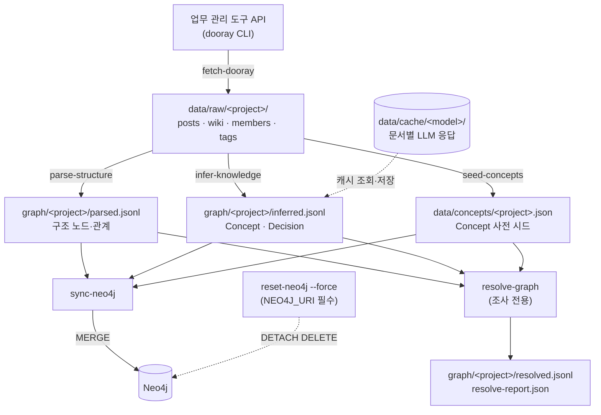
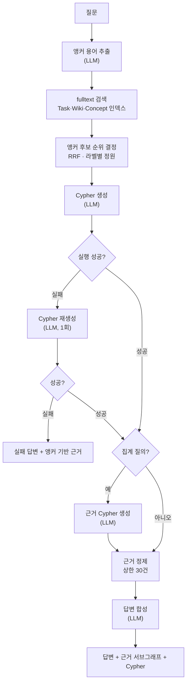

# 흐름 — 파이프라인과 질의응답

- 상태: 기준선 (2026-07-29 작성)

이 문서는 **무엇이 어디로 흐르는가**를 소유한다 — 단계 순서, 상태 전이, 실패와 부분 성공이다.
모듈 배치는 `docs/code-architecture.md`, 데이터 형식은 `docs/data-schema.md` 가 소유한다.

## 파이프라인 — 파일로 이어진 배치 체인

각 단계가 결과를 **파일로 떨어뜨리고** 다음 단계가 그 파일을 읽는다. 메모리를 공유하지 않는다.



`resolve-graph` 는 체인 위가 아니라 **옆에** 붙는다.
`sync-neo4j` 는 `resolved.jsonl` 을 읽지 않고 같은 순수 함수를 직접 부른다 — 그래서 stale 이 없다.
근거는 `docs/adr/0004-resolve-as-inspection-stage.md` 에 있다.

## 단계별 계약

| 단계 | 입력 | 출력 | 재실행 비용 |
| --- | --- | --- | --- |
| `fetch-dooray` | 외부 API | `data/raw/` | 네트워크. 원본 API 가 살아 있어야 한다 |
| `seed-concepts` | `data/raw/` | `data/concepts/` | 공짜 |
| `parse-structure` | `data/raw/` | `graph/parsed.jsonl` | **공짜** (수 초) |
| `infer-knowledge` | `data/raw/` | `graph/inferred.jsonl` | **문서 수만큼 LLM 호출** |
| `sync-neo4j` | 위 셋 | Neo4j | 되돌리기 어렵다 |

체인 밖 명령이다. 파이프라인을 흘리지 않고 상태를 조작하거나 관찰한다.

| 명령 | 성격 |
| --- | --- |
| `resolve-graph` | 정규화 결과를 파일로 내놓는다 (읽기 전용, 조사용) |
| `apply-schema` | Neo4j 제약·인덱스 적용 |
| `reset-neo4j` | 그래프 전체 삭제. `NEO4J_URI`·`--force` 필수, 운영 포트(`7687`)는 `--allow-production` 도 필요 |
| `audit-concepts` | Concept 정규화 감사 (읽기 전용) |

### 두 호출 경로가 같은 순수 함수를 공유한다

```
resolve-graph:  읽기 → 정리 → 정규화 → 파일 쓰기
sync-neo4j:     읽기 → 정리 → 정규화 → Neo4j 쓰기
```

앞 세 단계가 같은 함수다. 갈리는 것은 마지막 출력뿐이다.

**같은 입력이면 `resolved.jsonl` 이 바이트 동등해야 한다.** 그게 별칭 변경 전후 비교의 전제다.
출력 순서를 고정한다 — 노드는 `라벨 → 키 → tie-break`, 관계는 `유형 → 시작키 → 끝키 → tie-break` 다.
tie-break 는 파일에 실제로 쓰는 직렬화 바이트(`JSON.stringify` 결과) 자체다.

## 단계 경계를 가른 기준 — 재실행 비용

비용이 다른 것을 한 단계에 묶으면 **싼 것을 고치려고 비싼 것을 다시 돌리게 된다.**

- `parse-structure` 는 규칙 파싱이라 공짜다. 참조 패턴을 고쳐도 LLM 비용이 0이다
- `infer-knowledge` 는 문서 수만큼 LLM 을 부른다. 캐시 키가 `문서 id + 모델 + promptVersion` 이라
  **추출 프롬프트를 고치면 캐시가 전부 빗나가 전량 재호출된다**
- `sync-neo4j` 는 되돌리기 어렵다. 적재기가 MERGE 전용이라 삭제 경로가 없다

이 차이가 이름에 드러나야 한다. 이전 이름(`extract:structural`·`extract:llm`)은 둘 다 `extract:` 라서
비용 차이를 숨겼다.

## 질의응답 흐름



LLM 호출은 질의 1건당 **3~5회**다.

| 호출 | 조건 |
| --- | --- |
| 앵커 용어 추출 | 항상 |
| Cypher 생성 | 항상 |
| Cypher 재생성 | 실행 실패 시에만 |
| 근거 Cypher 생성 | 집계 질의일 때만 |
| 답변 합성 | 항상 |

## 실패와 부분 성공

파이프라인과 질의응답 모두 **부분 성공을 허용한다.** 한 건이 실패해도 전체를 중단하지 않는다.

| 지점 | 실패 처리 |
| --- | --- |
| `fetch-dooray` 개별 문서 | 실패 목록을 출력하고 exit 1. 수집은 전량 성공을 요구한다 |
| `infer-knowledge` 개별 문서 | 실패를 `inference-failures.json` 에 집계하고 나머지를 계속 진행한다 |
| `infer-knowledge` 관계 검증 | 스키마에 없는 관계는 버리고 `inference-dropped-relationships.json` 에 기록한다 |
| `sync-neo4j` 관계 적재 | 끝점 노드가 없으면 건너뛰고 집계한다. 단 구조 관계는 예외로 중단한다 |
| 질의 Cypher 실행 | 1회 재생성한다. 그래도 실패하면 앵커 기반 근거로 답한다 |
| 질의 답변 합성 | 실패하면 근거 요약으로 대체 답변을 만든다 |

**구조 관계만 중단시키는 이유** — 규칙 파싱은 결정적이라 끝점이 없으면 파싱 결함이다.
LLM 추출은 비결정적이라 일부 실패가 정상 범위다.

## 되돌리기

| 상황 | 방법 |
| --- | --- |
| 파일 산출물을 다시 만들고 싶다 | 해당 단계만 다시 돌린다. 앞 단계 산출물은 그대로 쓴다 |
| 그래프 노드를 줄이고 싶다 | 같은 `NEO4J_URI`로 `reset-neo4j --force` → `apply-schema` → `sync-neo4j`. **세 명령 모두 같은 URI 를 가리켜야 한다** — 뒤 두 명령은 인라인 지정이 없으면 기본값 `7687`로 붙는다. **초기화 없이는 줄지 않는다** |
| 추출 결과를 갱신하고 싶다 | 프롬프트를 고치면 `promptVersion` 을 올려야 캐시가 무효화된다 |

## 상태가 아닌 것

이 시스템에 **증분 상태가 없다.** 수집·추출·적재가 매번 전량을 다룬다.
그래서 "어디까지 처리했나" 를 추적하는 상태 저장소가 없고, 중단 후 재개도 파일 단위로만 이루어진다.

`fetch-dooray` 만 예외로 이미 받은 파일을 건너뛴다.
